Advanced use
===================

Adjusting parameters
----------------------------

There are a number of important considerations when running inStrain. Here is some theory and data about how to make inStrain work best

Reference genome selection
++++++++++++++++++++

inStrain relies on mapping reads from a sample to a reference genome. How similar the reference genome is to the reads, and the minimum read ANI threshold that you set, are very important and will determine much of what you get out of inStrain.

Below are a series of plots made by introducing a known number of mutations into an E. coli genome, simulating reads from these mutated genomes (at 20x coverage) with known ANI differences from the original reference genome, mapping the synthetic reads back to the original reference genome, and running inStrain.

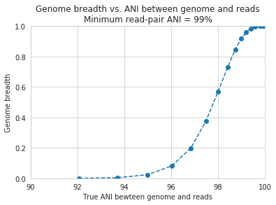

In the above plot, inStrain was run with a minimum read ANI of 0.99 (inStrain profile parameter `-l` or `--min_read_ani`). The reported genome breadth is reported on the y-axis. At 20x coverage, you should see 100% genome breadth (meaning that every base of the reference genome is covered by at least one read). However, when the reference genome is sufficiently different from the reads, the breadth is much lower. This is because when the read pair differs from the reference base by more than 99% ANI, it gets filtered out, and no longer maps to the genome. This can be exemplified a bit better by showing a variety of read filtering thresholds simultaneously:

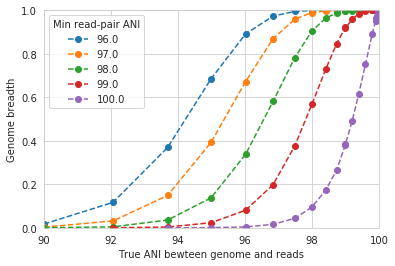

The line drawn in the first figure is now in red on this second figure. As you can see, the more you relax the minimum read ANI, the more you can align reads to more distantly related reference genomes.

.. warning::
  You don't want your minimum read pair ANI to be too relaxed, because then you risk mapping reads that don't actually belong to the population represented by your reference genome ("non-specific" mapping). You can also avoid non-specific mapping by increasing the size of your reference genome dataset (more on that below)

An important takeaway from the above figure is that the minimum read ANI should be at least 3% lower than the expected differences between your reads and the reference genome. If you look at the genome that's 96% ANI from the reads, for example, you see that none of the minimum read ANI levels get the correct breadth of 1. If you look at the genome that's 98% ANI from the reads, you can see that having a minimum read ANI of 96% is the only one that's actually near 100% breadth. This can also be visualized by looking at the distribution of ANI values of read pairs mapping to the 98% genome:

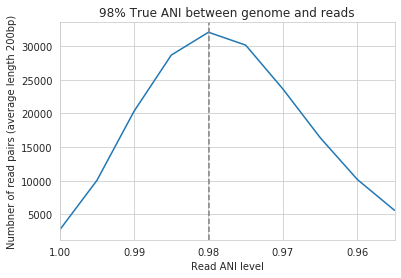

Most read pairs have 98%, as expected, but there is a wide distribution of read ANI values. This is because SNPs are not evenly spread along the genome, a fact that is even more true when you consider that real genomes likely have even more heterogeneity in where SNPs occur than this synthetic example.

The fact that the reads fail to map to heterogenous areas of the genome is also more problematic than it originally seems. It means that the area of the genome that are most similar to the sample reads will recruit reads during read mapping, but the (potentially interesting) areas with more SNPs will not. This is exemplified in the figure below:

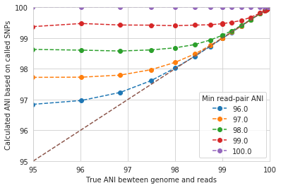

The y-axis in this figure shows the inStrain calculated ANI; that is, the number of identified SNPs divided by the number of bases with at least 5x coverage. If you look at red line, where only reads with at least 99% ANI are mapped, the ANI of reads mapping to the genome is almost always overestimated. This is because reads are only mapping to a small fraction of the genome (see the breadth in the second figure), and the small fraction of the genome that the reads are mapping to are the regions with a small number of SNPs.

By staring at this figure like I have, you'll notice that the correct ANI is identified when the minimum read pair ANI is 2-3% lower than the actual difference between the reads and the genome. 96% minimum ANI reads correctly identify the ANI of the 98% genome, for example.

Finally, in case you're wondering what the maximum read ANI is that bowtie2 is able to map, the answer is that it's complicated:

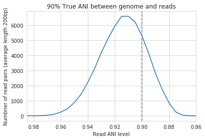

When mapping to a genome that is 90% ANI to the reads, you no longer see a peak at 90% as you do in the 98% example. This is because bowtie2 doesn't have a string ANI cutoff, it just maps what it can. This likely depends on where the SNPs are along the read, whether they're in the seed sequence that bowtie2 uses, etc. While bowtie2 can map reads that are up to 86% ANI with the reference genome, I wouldn't push it past 92% based on this graph.

.. note::
  In conclusion, you want your reference genome to be as similar to your reads as possible, and to set your minimum read-pair ANI to at least ~3% lower than the expected different from the reads and the reference genome. The inStrain default is 95% minimum read pair ANI, which is probably ideal in the case that you've assembled your reference genome from the sample itself. If you plan on using inStrain to map reads to a genome that you downloaded from a reference database, you may want to lower the minimum read-pair ANI to as low as ~92%, and ensure that the genome your mapping to is at least the same species as the organism in your reads (as genomes of the same species share ~95% ANI)

Mapping to multiple reference genomes
++++++++++++++++++++

Mapping to multiple genomes simultaneously to avoid mis-mapping
`````````````

There are a number of ways to avoid mis-mapped reads (reads from a different population mapping to your reference genome). One method is to filter out distantly related reads, including by using the minimum read-pair ANI threshold (`-l`, `--min_read_ani`) or by using the mapQ score cutoff (more on that later). Another method is to include multiple reference genomes in the `.fasta` file that you map to, which gives the mapping software a chance to better place your reads.

When bowtie2 maps reads, by default, it only maps reads to a single location. That means that if a read maps at 98% ANI to one scaffold, and 99% ANI to another scaffold, it will place the read at the position with 99% ANI. If the read only maps to one scaffold at 98% ANI, however, bowtie2 will place the read there. Thus, by including more reference genome sequences when performing the mapping, reads will end up mapping more accurately overall.

**Based on the above information, if you'd like to run inStrain on multiple reference genomes for the same set of reads, you should concatenate the genomes first and map to the concatenated genome set. You can then use inStrain genome_wide to get information on each genome individually.**

.. note::
  You can get an idea of the extent of mis-mapping going on in your sample by looking at the variation in coverage across the genome. If you see a region of the genome with much higher coverage than the rest, it is likely that that region is recruiting reads from another population. Looking at these wavy coverage patterns can be confusing, however. Here is a `link <http://merenlab.org/2016/12/14/coverage-variation/>`_ for more information on this phenomenon.

.. warning::
  It is possible to include too many genomes in your reference .fasta file, however. You generally don't want to have genomes that are over 98% ANI to each other in your reference genome set, because then the genomes can steal reads from each other. More on that below.

Read stealing due to including closely related genomes in the reference .fasta file
`````````````

If bowtie2 finds a read that maps equally well to multiple different positions in your .fasta file, it will randomly choose one of the two positions to place the read at. Because of this, you really don't want to have multiple positions in your .fasta file that are identical. At these positions it is impossible for the alignment algorithm to known which reference sequence the read should actually map to. You can then end up with "read stealing", where closely related genomes will steal reads from the true reference genome.

In the below example, thousands of bacterial genomes were dereplicated at 99.8% ANI and combined into a single .fasta file. One genome was randomly chosen to profile, and reads from the sample from which that genome was assembled were mapped to this concatenation of all genomes together and to that one genome individually. We then profiled the difference in read mapping when mapping to the two different .fasta files. Specifically, we looked at reads that mapped to the genome of interest when mapping to that genome individually, and mapped elsewhere when mapping to all genomes concatenated together.

.. figure:: images/RefFig1.png
  :width: 400px
  :align: center

Each dot represents a genome in the concatenated genome set. The position on the x-axis indicates that genomes ANI to the genome of interest (orange dot), and the position on the y-axis indicates the number of reads that were stolen from the genome of interest. The number of reads that were stolen from the genome of interest is the number of reads that mapped to the genome of interest when it was mapped to as an individual .fasta file, but that now map to a different genome when reads were mapped to a concatenation of many genomes together.

As you can see, the more closely related an alternate genome is to a genome of interest, the more likely it is steal reads. This makes sense, because assuming that the genomes represented by blue dots are not actually present in the sample (likely true in this case), the only way these genomes have reads mapped to them is be having regions that are identical to the genome that is actually present in the sample. In fact, you can even calculate the probability of having an identical region as long as a pair of reads (190bp in this case) based on the genome ANI using the formula: Probability of identical 190bp fragment = (genome ANI) ^ 190. We can then overlay this onto the above plot:

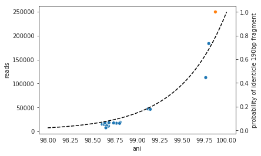

This simple formula fits the observed trend remarkably well, providing pretty good evidence that simple genome-ANI-based read stealing is what is going on.

.. note::

  In the above example, read stealing approaches 0 at around 98% ANI. Thus, when dereplicating your genome set (using `dRep <https://github.com/MrOlm/drep>`_ for example), using a threshold of 98% or lower is a good idea.

As a final check, we can also filter reads by MapQ score. A MapQ is assigned to each read mapped by bowtie2, and is meant to signify how well the read mapped. MapQ scores are incredibly confusing (see the following `link <http://biofinysics.blogspot.com/2014/05/how-does-bowtie2-assign-mapq-scores.html>`_ for more information), but MapQ scores of 0 and 1 have a special meaning. If a read maps equally well to multiple different locations on a .fasta file, it always gets a MapQ score of 0 or 1. Thus, by filtering out reads with MapQ scores < 2, we can see reads that map uniquely to one genome only.

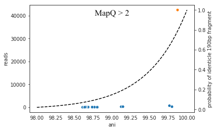

Just as we suspected, read no longer map to these alternate genomes at all. This provides near conclusive evidence that the organisms with these genomes are not truly in the sample, but are merely stealing reads from the genome of the organisms that is there by having regions of identical DNA. For this reason it can be smart to set a minimum MapQ score of 2 to avoid mis-mapping, but at the same time, look at the difference in the number of reads mapping to the correct genome when the MapQ filter is used- 85% of the reads are filtered out. Using MapQ filters is a matter of debate depending on your specific use-case.

Other considerations
`````````````

A final aspect to consider is de novo genome assembly. When multiple closely related genomes are present in a sample, the assembly algorithm can break and you can fail to recover genomes from either organism. A solution to this problem is to assemble and bin genomes from each metagenomic sample individually, and dereplicate the genome set at the end. For more information on this, see the publication `"dRep: a tool for fast and accurate genomic comparisons that enables improved genome recovery from metagenomes through de-replication" <https://www.nature.com/articles/ismej2017126>`_

Assuming you de-replicate your genomes at 98% before mapping to run inStrain, another matter to consider is how you define detection of a genome in a sample. The following figure shows the expected genome overlap between genomes of various ANI values from different environments (adapted from `"Consistent metagenome-derived metrics verify and define bacterial species boundaries" <https://www.biorxiv.org/content/early/2019/05/24/647511.full.pdf>`_)

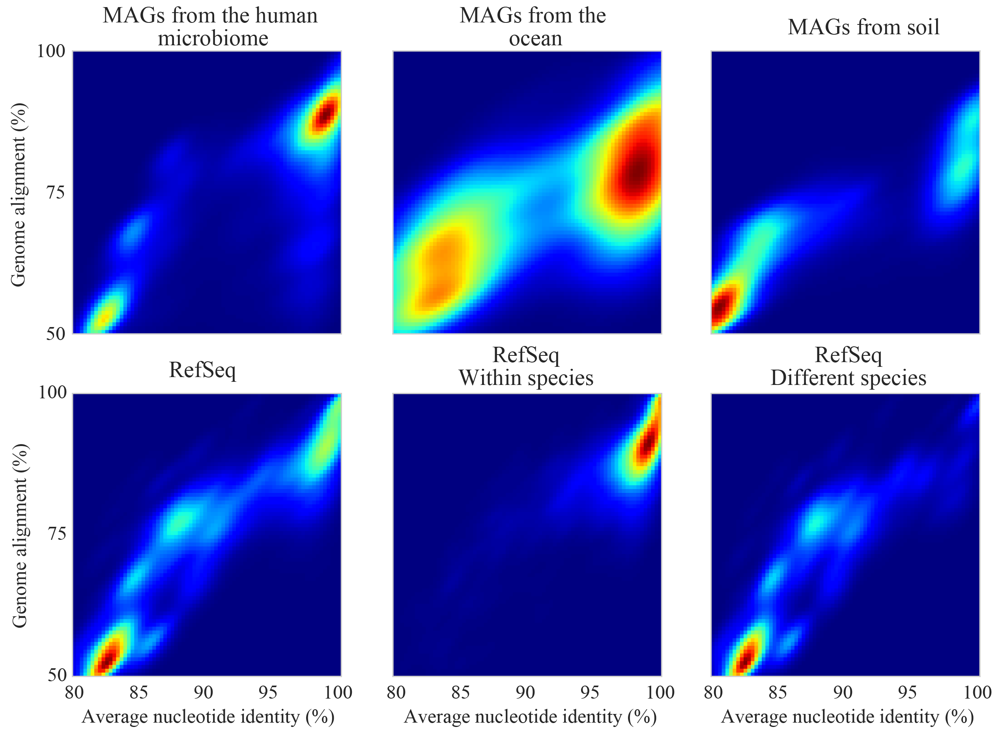

As you can see, genomes from that share >95% ANI tend to share ~75% of their genome content. Thus, using a breadth detection cutoff of somewhere around 50-75% seems to be reasonable.

.. note::

  Based on the above information we recommend the following pipeline. 1) Assemble and bin genomes from all samples individually. 2) Dereplicate genomes based on 97-98% ANI. 3) Concatenate all dereplicated genomes into a single .fasta file, and map reads from all original samples to this concatenated .fasta file. 4) Use inStrain to profile the strain-level diversity of each microbial population (represented by a genome in your concatenated .fasta file)

Detecting closely related organisms with inStrain compare
+++++++++++++

To compare strains with inStrain, one must first generate two inStrain profiles (using the command `inStrain profile`) based on mapping reads to the same .fasta file. `inStrain compare` then compares the reads mapped from both samples to the same .fasta file to calculate an extremely precise and accurate ANI value for the populations in the two samples. In order for this to work well, however, there are a number of things that you must keep in mind.

Same as `inStrain profile`, `inStrain compare` requires the user to think about the minimum read-pair ANI that should be considered. It will use the read-pair ANI selected during the `inStrain profile` commands by default, but the user can also access many other min read-pair ANI values using the ANI (see section `Dealing with "mm"` below for more information)

Below are a series of plots generated from synthetic data. In these plots, a reference genome was downloaded from NCBI and mutated to a series of known ANI values. Synthetic reads were generated from each of these mutated genomes, mapped back to the original genome, and then `inStrain profile` was run on the resulting .bam file. Synthetic reads were also generated from the original genome and mapped back to it as well. Finally, `inStrain compare` was run to compare the .bams resulting the mutated genomes to the original genome. This allows us to compare the (pop)ANI value reported by inStrain compare to the true ANI value (generated by introducing a known number of mutations).

.. note::
    The ANI values reported from inStrain compare are referred to as popANI values

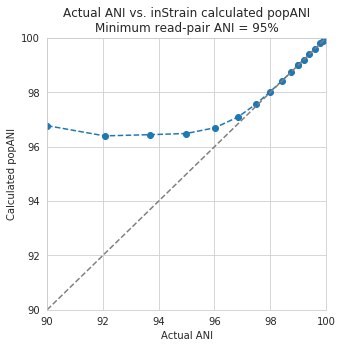

As you can see, the calculated popANI value is incorrect when the actual ANI different is large. This makes sense based on the section above. When mapping reads from an organism that is 90% ANI to the .fasta file that you're mapping to, many read-pairs will have an ANI of over 90%, and thus be thrown out when using a 95% read-pair ANI cutoff. This can also be exemplified by looking at the fraction of the genome that is compared when comparing genomes of increasing ANI.

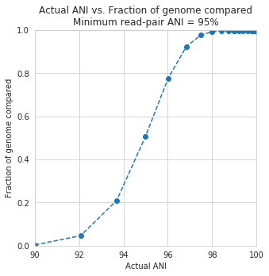

As expected, when comparing genomes of low ANI values with a read-pair ANI threshold of 95%, only a small amount of the genome is actually being compared. This genome fraction represents the spaces of the genome that happen to be the most similar, and thus the inStrain calculated ANI value is overestimated. It's also worth noting that when comparing genomes 95% ANI away from each other, only 50% of the genome bases can be compared when you filter read-pairs at a minimum of 95% ANI. You can also visualize how a lack of genome breadth of coverage leads to errors in the ANI calculation in another way:

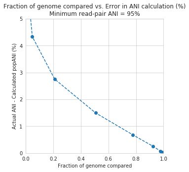

Now that we understand all of this, lets visualize lots of minimum read-pair ANI cutoffs simultaneously

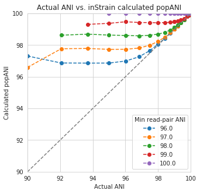

There are a couple of things to point out here.

1) Having a lower minimum read-pair ANI cutoff lets you accurately detect more distant ANI values. This makes sense given the logic above.

2) There is a ceiling to how much the ANI is overestimated. If your minimum read-pair ANI is 96%, you think even very distantly related things have an ANI of ~96.5% ANI. If the minimum ANI threshold is 98%, you think distantly related things are ~98.5% ANI.

3) To get an accurate ANI value, you need to set your minimum read-pair ANI cutoff significantly below the ANI value that you wish to detect.

All of this begs the question, why would you ever set your minimum ANI threshold above 90% or so? If you're comparing clonal genomes, that would be a good idea. However, in most real scenarios, you want to set your minimum ANI threshold as high as possible to avoid mis-mapped reads, which will artificially increase your reported popANI.

Finally, this brings is to perhaps the most confusing yet import figure of this whole section. If I want to identify nearly identical genomes in two samples, what should I set my minimum ANI threshold to?

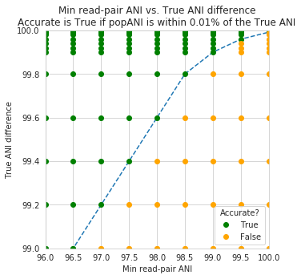

The above figure shows a range of minimum read-pair ANI thresholds on the x-axis, and a range of True ANI differences between genomes on the y-axis. Dots are colored green if the reported popANI is within 0.01% ANI of the True ANI, and colored yellow if they are not. As you can see, when you want to identify genomes that are extremely closely related (>99.9%), pretty much all minimum read-pair ANI thresholds values work. This is because if the genomes are that similar, there are going to be few reads that are thrown out due to have too many SNPs. This figure looks a bit more odd when you consider an "accurate" comparison to be one with 0.001% of the actual ANI

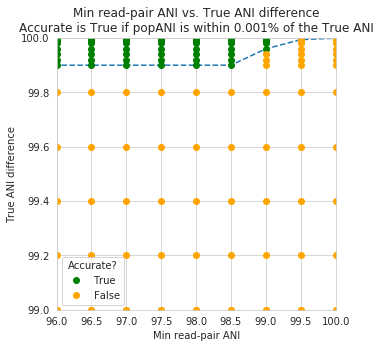

However, you also need to keep in mind that you want to have high breadth of coverage for each of the reads mapped to the reference genome. If the reference genome is not perfect, you need to relax your ANI threshold even more

.. note::
    In conclusion: If you have a reference genome that closely represents the true organism, and you want to identify extremely similar genomes (>99.999% ANI), a minimum read-pair ANI threshold of 98% is probably good. If you are working with a de-replicated set of genomes that you're mapping to, however (as recommended above), a minimum read-pair ANI threshold of 95% is probably better.


Accessing raw data
--------------

inStrain stores much more data than is shown in the output folder. It is kept in the ``raw_data`` folder, and is mostly stored in compressed formats (see the section "Descriptions of raw data" for what kinds of data are available). This data can be easily accessed using python, as described below.

To access the data, you first make an SNVprofile object of the inStrain output profile, and then you access data from that object. For example, the following code accessed the raw SNP table ::

  import inStrain
  import inStain.SNVprofile

  IS = inStain.SNVprofile.SNVprofile(``/home/mattolm/inStrainOutputTest/``)
  raw_snps = IS.get('raw_snp_table')


You can use the example above (``IS.get()``) to access any of the raw data described in the following section. There are also another special things that are accessed in other ways, as described in the section "Accessing other data"

Basics of raw_data
++++++++++

A typical run of inStrain will yield a folder titled "raw_data", with lots of individual files in it. The specifics of what files are in there depend on how inStrain was run, and whether or not additional commands were run as well (like profile_genes).

There will always be a file titled "attributes.tsv". This describes some basic information about each item in the raw data. Here's an example::

  name	value	type	description
  location	/Users/mattolm/Programs/strains_analysis/test/test_data/N5_271_010G1_scaffold_min1000.fa-vs-N5_271_010G2.sorted.bam.v6.IS	value	Location of SNVprofile object
  version	0.6.0	value	Version of inStrain
  bam_loc	N5_271_010G1_scaffold_min1000.fa-vs-N5_271_010G2.sorted.bam	value	Location of .bam file
  scaffold_list	/home/mattolm/Bio_scripts/TestingHouse/N5_271_010G1_scaffold_min1000.fa-vs-N5_271_010G2.sorted.bam.v6.IS/raw_data/scaffold_list.txt	list	1d list of scaffolds, in same order as counts_table
  counts_table	/home/mattolm/Bio_scripts/TestingHouse/N5_271_010G1_scaffold_min1000.fa-vs-N5_271_010G2.sorted.bam.v6.IS/raw_data/counts_table.npz	numpy	1d numpy array of 2D counts tables for each scaffold
  scaffold2length	/home/mattolm/Bio_scripts/TestingHouse/N5_271_010G1_scaffold_min1000.fa-vs-N5_271_010G2.sorted.bam.v6.IS/raw_data/scaffold2length.json	dictionary	Dictionary of scaffold 2 length
  window_table	/home/mattolm/Bio_scripts/TestingHouse/N5_271_010G1_scaffold_min1000.fa-vs-N5_271_010G2.sorted.bam.v6.IS/raw_data/window_table.csv.gz	pandas	Windows profiled over (not sure if really used right now)
  raw_linkage_table	/home/mattolm/Bio_scripts/TestingHouse/N5_271_010G1_scaffold_min1000.fa-vs-N5_271_010G2.sorted.bam.v6.IS/raw_data/raw_linkage_table.csv.gz	pandas	Raw table of linkage information
  raw_snp_table	/home/mattolm/Bio_scripts/TestingHouse/N5_271_010G1_scaffold_min1000.fa-vs-N5_271_010G2.sorted.bam.v6.IS/raw_data/raw_snp_table.csv.gz	pandas	Contains raw SNP information on a mm level
  cumulative_scaffold_table	/home/mattolm/Bio_scripts/TestingHouse/N5_271_010G1_scaffold_min1000.fa-vs-N5_271_010G2.sorted.bam.v6.IS/raw_data/cumulative_scaffold_table.csv.gz	pandas	Cumulative coverage on mm level. Formerly scaffoldTable.csv
  cumulative_snv_table	/home/mattolm/Bio_scripts/TestingHouse/N5_271_010G1_scaffold_min1000.fa-vs-N5_271_010G2.sorted.bam.v6.IS/raw_data/cumulative_snv_table.csv.gz	pandas	Cumulative SNP on mm level. Formerly snpLocations.pickle
  scaffold_2_mm_2_read_2_snvs	/home/mattolm/Bio_scripts/TestingHouse/N5_271_010G1_scaffold_min1000.fa-vs-N5_271_010G2.sorted.bam.v6.IS/raw_data/scaffold_2_mm_2_read_2_snvs.pickle	pickle	crazy nonsense needed for linkage
  covT	/home/mattolm/Bio_scripts/TestingHouse/N5_271_010G1_scaffold_min1000.fa-vs-N5_271_010G2.sorted.bam.v6.IS/raw_data/covT.hd5	special	Scaffold -> mm -> position based coverage
  snpsCounted	/home/mattolm/Bio_scripts/TestingHouse/N5_271_010G1_scaffold_min1000.fa-vs-N5_271_010G2.sorted.bam.v6.IS/raw_data/snpsCounted.hd5	special	Scaffold -> mm -> position based True/False on if a SNPs is there
  clonT	/home/mattolm/Bio_scripts/TestingHouse/N5_271_010G1_scaffold_min1000.fa-vs-N5_271_010G2.sorted.bam.v6.IS/raw_data/clonT.hd5	special	Scaffold -> mm -> position based clonality
  mapping_info	/home/mattolm/Bio_scripts/TestingHouse/N5_271_010G1_scaffold_min1000.fa-vs-N5_271_010G2.sorted.bam.v6.IS/raw_data/mapping_info.csv.gz	pandas	Report on reads

This is what the columns correspond to:

name
  The name of the data. This is the name that you put into ``IS.get()`` to have inStrain retrieve the data for you. See the section "Accessing raw data" for an example.

value
  This lists the path to where the data is located within the raw_data folder. If the type of data is a value, than this just lists the value

type
  This describes how the data is stored. Value = the data is whatever is listed under value; list = a python list; numpy = a numpy array; dictionary = a python dictionary; pandas = a pandas dataframe; pickle = a piece of data that's stored as a python pickle object; special = a piece of data that is stored in a special way that inStrain knows how to de-compress

description
  A one-sentence description of what's in the data.

.. warning::

  Many of these pieces of raw data have the column "mm" in them, which means that things are calculated at every possible read mismatch level. This is often not what you want. See the section "Dealing with mm" for more information.

Accessing other data
++++++++++

In addition to the raw_data described above, there are a couple of other things that inStrain can make for you. You access these from methods that run on the IS object itself, instead of using the ``get`` method. For example::

  import inStrain
  import inStain.SNVprofile

  IS = inStain.SNVprofile.SNVprofile(``/home/mattolm/inStrainOutputTest/``)
  coverage_table = IS.get_raw_coverage_table()

The fellowing methods work like that:

get_nonredundant_scaffold_table()
  Get a scaffold table with just one line per scaffold, not multiple mms

get_nonredundant_linkage_table()
  Get a linkage table with just one line per scaffold, not multiple mms

get_nonredundant_snv_table()
  Get a SNP table with just one line per scaffold, not multiple mms

get_clonality_table()
  Get a raw clonality table, listing the clonality of each position. Pass `nonredundant=False` to keep multiple mms

Dealing with "mm"
++++++++++

Behind the scenes, inStrain actually calculates pretty much all metrics for every read pair mismatch level. That is, only including read pairs with 0 mis-match to the reference sequences, only including read pairs with >= 1 mis-match to the reference sequences, all the way up to the number of mismatches associated with the "PID" parameter.

For most of the output that inStrain makes in the output folder, it removes the "mm" column and just gives the results for the maximum number of mismatches. However, it's often helpful to explore other mismatches levels, to see how parameters vary with more or less stringent mappings. Much of the data stored in "read_data" is on the mismatch level. Here's an example of what the looks like (this is the cumulative_scaffold_table)::

  ,scaffold,length,breadth,coverage,coverage_median,coverage_std,bases_w_0_coverage,mean_clonality,median_clonality,unmaskedBreadth,SNPs,breadth_expected,ANI,mm
  0,N5_271_010G1_scaffold_102,1144,0.9353146853146853,5.106643356643357,5,2.932067325774674,74,1.0,1.0,0.6145104895104895,0,0.9889923642060382,1.0,0
  1,N5_271_010G1_scaffold_102,1144,0.9353146853146853,6.421328671328672,6,4.005996333777764,74,0.9992001028104149,1.0,0.6748251748251748,0,0.9965522492489882,1.0,1
  2,N5_271_010G1_scaffold_102,1144,0.9423076923076923,7.3627622377622375,7,4.2747074564903285,66,0.9993874800638958,1.0,0.7928321678321678,0,0.998498542620078,1.0,2
  3,N5_271_010G1_scaffold_102,1144,0.9423076923076923,7.859265734265734,8,4.748789115369562,66,0.9992251555869703,1.0,0.7928321678321678,0,0.9990314705263914,1.0,3
  4,N5_271_010G1_scaffold_102,1144,0.9423076923076923,8.017482517482517,8,4.952541407151938,66,0.9992251555869703,1.0,0.7928321678321678,0,0.9991577528529144,1.0,4
  5,N5_271_010G1_scaffold_102,1144,0.9458041958041958,8.271853146853147,8,4.9911156795536105,62,0.9992512780077317,1.0,0.8024475524475524,0,0.9993271891539499,1.0,7

As you can see, the same scaffold is shown multiple times, and the last column is ``mm``. At the row with mm = 0, you can see what the stats are when only considering reads that perfectly map to the reference sequence. As the mm goes higher, so do stats like coverage and breadth, as you now allow reads with more mismatches to count in the generation of these stats. In order to convert this files to what is provided in the output folder, the following code is run::

  import inStrain
  import inStain.SNVprofile

  IS = inStain.SNVprofile.SNVprofile(``/home/mattolm/inStrainOutputTest/``)
  scdb = IS.get('cumulative_scaffold_table')
  ScaffDb = scdb.sort_values('mm')\
              .drop_duplicates(subset=['scaffold'], keep='last')\
              .sort_index().drop(columns=['mm'])

The last line looks complicated, but it's very simple what is going on. First, you sort the database by ``mm``, with the lowest mms at the top. Next, for each scaffold, you only keep the row with the lowest mm. That's done using the ``drop_duplicates(subset=['scaffold'], keep='last')`` command. Finally, you re-sort the DataFrame to the original order, and remove the ``mm`` column. In the above example, this would mean that the only row that would survive would be where mm = 7, because that's the bottom row for that scaffold.

You can of course subset to any level of mismatch by modifying the above code slightly. For example, to generate this table only using reads with <=5 mismatches, you could use the following code::

  import inStrain
  import inStain.SNVprofile

  IS = inStain.SNVprofile.SNVprofile(``/home/mattolm/inStrainOutputTest/``)
  scdb = IS.get('cumulative_scaffold_table')
  scdb = scdb[scdb['mm'] <= 5]
  ScaffDb = scdb.sort_values('mm')\
              .drop_duplicates(subset=['scaffold'], keep='last')\
              .sort_index().drop(columns=['mm'])

.. warning::

  You usually do not want to subset these DataFrames using something like ``scdb = scdb[scdb['mm'] == 5]``. That's because if there are no reads that have 5 mismatches, as in the case above, you'll end up with an empty DataFrame. By using the drop_duplicates technique described above you avoid this problem, because in the cases where you don't have 5 mismatches, you just get the next-highest mm level (which is usually what you want)

Performance issues
+--------------

inStrain uses a lot of RAM. In the log file, it often reports how much RAM it's using and how much system RAM is available. To reduce RAM usage, you can try the following things:

* Use the ``--skip_mm`` flag. This won't profile things on the mm level (see the above section), and will treat every read pair as perfectly mapped

* Use ``quick_profile`` to figure out which scaffolds actually have reads mapping to them, and only run inStrain on those

A quick and dirty estimate of resources required (as of version 1.2.12):

The required RAM (in Gb) is 0.4 times the length of the .fasta being mapped to (in Mbp). This is assuming the whole genome is covered by at least 1 read; portions of the .fasta file that have 0 reads mapping do not count.

The runtime (in minutes) is 13 times the number of read base pairs in the input .bam file (in Gbp).

A note for programmers
--------------

If you'd like to edit inStrain to add functionality for your data, don't hesitate to reach out to the authors of this program for help. Additionally, please consider submitting a pull request on GitHub so that others can use your changes as well.
