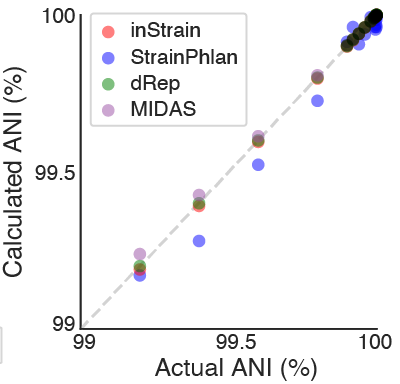
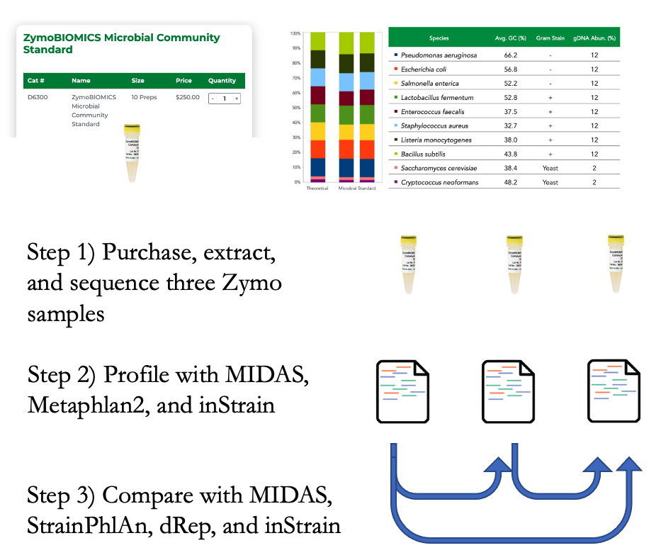
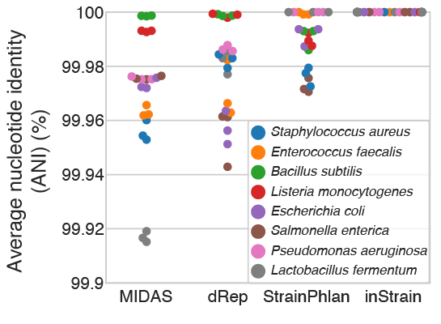
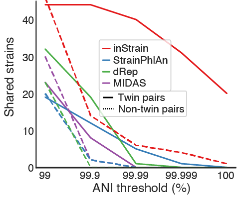
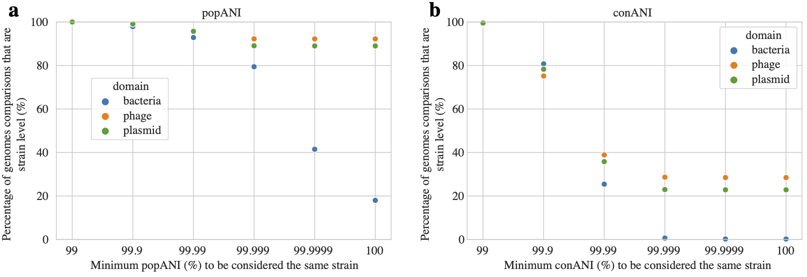

Benchmarks
==============================

This page contains data from tests performed to evaluate the accuracy inStrain. In most cases similar tests were performed to compare inStrain's accuracy to other leading tools. Most of these benchmarks are adapted from the `inStrain publication <https://www.biorxiv.org/content/10.1101/2020.01.22.915579v1>`_ where you can find more details on how they were performed.

Strain-level comparisons
+++++++++++++++++++++++++++++++++++

This section contains a series of benchmarks evaluating the ability of inStrain to perform detailed strain-level comparisons. In all cases inStrain is benchmarked against three leading tools:

`MIDAS <https://github.com/snayfach/MIDAS>`_ - an integrated pipeline to estimate bacterial species abundance and strain-level genomic variation. Strain-level comparisons are based on consensus alleles called on whole genomes. The script `strain_tracking.py <https://github.com/snayfach/MIDAS/blob/master/docs/strain_tracking.md>`_ was used for benchmarks.

`StrainPhlAn <https://github.com/biobakery/biobakery/wiki/strainphlan1>`_ - a tool for strain-level resolution of species across large sample sets, based on consensus single nucleotide polymorphisms (SNPs) called on species marker genes. Based on the MetaPhlAn2 db_v20 database.

`dRep <https://drep.readthedocs.io/en/latest/>`_ - a genome alignment program. dRep does not purport to have accuracy over 99.9% :term:`ANI` and was just used for comparison purposes.

Benchmark with synthetic data
------------------------------

A straightforward in silico test. A `randomly selected E. coli genome <https://www.ncbi.nlm.nih.gov/assembly/GCF_000988385.1>`_ was downloaded and mutated to various chosen ANI levels using `SNP Mutator <https://github.com/CFSAN-Biostatistics/snp-mutator>`_. The original genome was compared to the mutated genome, and we looked for the difference between the actual :term:`ANI` and the calculated ANI (the ANI reported by each program).

All four methods performed well on this test, although dRep, inStrain, and MIDAS had lower errors in the ANI calculation than StrainPhlAn overall (0.00001%, 0.002%, 0.006% and 0.03%, respectively; average discrepancy between the true and calculated ANI). This is likely because dRep, inStrain, and MIDAS compare positions from across the entire genome (99.99998%, 99.7%, and 85.8% of the genome, respectively) and StrainPhlAn does not (0.3% of the genome).

**Methods for synthetic data benchmark:**

For dRep, mutated genomes were compared to the reference genome using dRep on default settings. For inStrain, MIDAS, andStrainPhlAn, Illumina reads were simulated for all genomes at 20x coverage using `pIRS <https://github.com/galaxy001/pirs#:~:text=FASTA...-,pIRS%20is%20a%20program%20for%20simulating%20paired%2Dend%20reads%20from,any%20number%20of%20reference%20sequences.>`_.

For inStrain, synthetic reads were mapped back to the reference genome using Bowtie 2, profiled using “inStrain profile” under default settings, and compared using “inStrain compare” under default settings.

For StrainPhlAn, synthetic reads profiled with Metaphlan2, resulting marker genes were aligned using StrainPhlan, and the ANI of resulting nucleotide alignments was calculated using the class “Bio.Phylo.TreeConstruction.DistanceCalculator('identity')” from the BioPython python package.

For MIDAS, synthetic reads were provided to the program directly using the “run_midas.py species” command, and compared using the “run_midas.py snps” command. The ANI of the resulting comparisons was calculated as “[mean(sample1_bases, sample2_bases) - count_either] / mean(sample1_bases, sample2_bases)”.

Benchmark with defined microbial communities
---------------------------------------------

This test (schematic above) involved comparing real metagenomes derived from defined bacterial communities. The `ZymoBIOMICS Microbial Community Standard <https://www.zymoresearch.com/collections/zymobiomics-microbial-community-standards/products/zymobiomics-microbial-community-standard>`_, which contains cells from eight bacterial species at defined abundances, was divided into three aliquots and subjected to DNA extraction, library preparation, and metagenomic sequencing. **The same community of 8 bacterial species was sequenced 3 times, so each program should report 100% :term:`ANI` for all species comparisons.** Deviations from this ideal either represent errors in sequence alignment, the presence of microdiversity consistent with maintenance of cultures in the laboratory, or inability of programs to handle errors and biases introduced during routine DNA extraction, library preparation, and sequencing with Illumina).

MIDAS, dRep, StrainPhlAn, and inStrain reported average ANI values of 99.97%, 99.98%, 99.990% and 99.999998%, respectively, with inStrain reporting average :term:`popANI` values of 100% for 23 of the 24 comparisons and 99.99996% for one comparison. The difference in performance likely arises because the Zymo cultures contain non-fixed nucleotide variants that inStrain uses to confirm population overlap but that confuse the consensus sequences reported by dRep, StrainPhlAn, and MIDAS (:term:`conANI`). We also used this data to establish a threshold for the detection of “same” versus “different” strains. The thresholds for MIDAS, dRep, StrainPhlAn, and inStrain, calculated based on the comparison with the lowest average ANI across all 24 sequence comparisons, are shown in the table below.

===========  ======================      =================
Program      Minimum reported ANI        Years divergence
===========  ======================      =================
MIDAS        99.92%                      3771
dRep         99.94%                      2528
StrainPhlAn  99.97%                      1307
InStrain     99.99996%                   2.2
===========  ======================      =================

Years divergence was calculated from "minimum reported ANI" using the previously reported rate of 0.9 :term:`SNS`s accumulated per genome per year in the gut microbiome of healthy human adults `(Zhao 2019) <https://doi.org/10.1016/j.chom.2019.03.007>`_ . **This benchmark demonstrates that inStrain can be used for detection of identical microbial strains with a stringency that is substantially higher than other tools**. Stringent thresholds are useful for strain tracking, as strains that have diverged for hundreds to thousands of years are clearly not linked by a recent transmission event.

We also performed an additional benchmark with this data on inStrain only. InStrain relies on :term:`Representative genome`s to calculate :term:`popANI`, so we wanted to know whether using non-ideal reference genomes would impact it's accuracy. By mapping reads to all 4,644 representative genomes in the `Unified Human Gastrointestinal Genome (UHGG) collection <https://www.nature.com/articles/s41587-020-0603-3>`_ we identified the 8 relevant :term:`Representative genome`s. These genomes had between 93.9% - 99.6% ANI to the organisms present in the Zymo samples. InStrain comparisons based on these genomes were still highly accurate (average 99.9998% ANI, lowest 99.9995% ANI, limit of detection 32.2 years), highlighting that inStrain can be used with reference genomes from databases when sample-specific reference genomes cannot be assembled.

**Methods for defined microbial community benchmark:**

`Reads from Zymo samples are available under BioProject PRJNA648136 <https://www.ncbi.nlm.nih.gov/bioproject/?term=PRJNA648136>`_

For dRep, reads from each sample were assembled independently using IDBA_UD, binned into genomes based off of alignment to the `provided reference genomes <https://s3.amazonaws.com/zymo-files/BioPool/ZymoBIOMICS.STD.refseq.v2.zip>`_ using nucmer, and compared using dRep on default settings.

For StrainPhlAn, reads from Zymo samples profiled with Metaphlan2, resulting marker genes were aligned using StrainPhlan, and the ANI of resulting nucleotide alignments was calculated as described in the synthetic benchmark above.

For MIDAS, reads from Zymo samples were provided to MIDAS directly and the ANI of sample comparisons was calculated as described in the synthetic benchmark above.

For inStrain, reads from Zymo samples were aligned to the provided reference genomes using Bowtie 2, profiled using “inStrain profile” under default settings, and compared using “inStrain compare” under default settings. :term:`popANI` values were used for inStrain.

Eukaryotic genomes were excluded from this analysis, and **raw values are available in Supplemental Table S1 of the inStrain manuscript**. To evaluate inStrain when using genomes from public databases, all reference genomes from the UHGG collection were downloaded and concatenated into a single .fasta file. Reads from the Zymo sample were mapped against this database and processed with inStrain as described above. The ability of each method to detect genomes was performed using all Zymo reads concatenated together.

Benchmark with true microbial communities
---------------------------------------------

This test evaluated the stringency with which each tool can detect shared strains in genuine microbial communities. Tests like this are hard to perform because it is difficult to know the ground truth. We can never *really* know whether two true genuine communities *actually* share strains. For this test we leveraged the fact that `new-born siblings share far more strains than unrelated newborns. <https://www.nature.com/articles/ismej201683>`_. In this test, **we compared the ability of the programs to detect strains shared by twin premature infants (presumably True Positives) vs. their detection of strains shared by unrelated infants (presumably False Positives).**

All methods identified significantly more strain sharing among twin pairs than pairs of unrelated infants, as expected, and inStrain remained sensitive at substantially higher ANI thresholds than the other tools. The reduced ability of StrainPhlAn and MIDAS to identify shared strains is likely based on their reliance on consensus-based ANI (:term:`conANI`) measurements. We know that microbiomes can contain multiple coexisting strains, and when two or more strains of a species are in a sample at similar abundance levels it can lead to pileups of reads from multiple strains and chimeric sequences. The :term:`popANI` metric is designed to account for this complexity.

It is also worth discussing Supplemental Figure S5 from the inStrain manuscript here.

This figure was generated from genomic comparisons between genomes present in the same infant over time (longitudinal data). In cases where the same genome was detected in multiple time-points over the time-series sampling of an infant, the percentage of comparisons between genomes that exceed various popANI (a) and conANI (b) thresholds is plotted. This figure shows that the use of popANI allows greater stringency than conANI.

.. note::
    Based on the data presented in the above tests, a threshold of 99.999% popANI was chosen as the threshold to define bacterial, bacteriophage, and plasmid strains for the work presented in the inStrain manuscript. This is likely a good threshold for a variety of communities.

**Methods for true microbial community benchmark:**

Twin-based comparisons were performed on three randomly chosen sets of twins that were sequenced during a previous study `(Olm 2019) <https://doi.org/10.1126/sciadv.aax5727>`_. `Reads can be found under Bioproject PRJNA294605 <https://www.ncbi.nlm.nih.gov/bioproject/?term=PRJNA294605>`_

For StrainPhlAn, all reads sequenced from each infant were concatenated and profiled using Metaphlan2, compared using StrainPhlAn, and the ANI of resulting nucleotide alignments was calculated as described for the synthetic benchmark.

For MIDAS, all reads sequenced from each infant were concatenated and profiled with MIDAS, and the ANI of species profiled in multiple infants was calculated as described for the synthetic benchmark.

For dRep, all de-replicated bacterial genomes assembled and binned from each infant (available from `(Olm 2019) <https://doi.org/10.1126/sciadv.aax5727>`_) were compared in a pairwise manner using dRep under default settings.

For inStain, strain-sharing from these six infants was determined using the methods described below.

ANI values from all compared genomes and the number of genomes shared at a number of ANI thresholds are available for all methods in Supplemental Table S1 of the inStrain publication.

Species-level community profiling
+++++++++++++++++++++++++++++++++++

This section contains tests evaluating the ability of inStrain and other tools to accurately profile microbial communities. Here inStrain is benchmarked against two other tools:

`MIDAS <https://github.com/snayfach/MIDAS>`_ - an integrated pipeline to estimate bacterial species abundance and strain-level genomic variation.

`MetaPhlAn 2 <http://huttenhower.sph.harvard.edu/metaphlan2>`_ - a computational tool for profiling the composition of microbial communities from metagenomic shotgun sequencing data. MetaPhlAn 2 uses  unique clade-specific marker genes.

Benchmark with defined microbial communities
---------------------------------------------

This test evaluated the ability of programs to identify the microbial species present in metagenomes of defined bacterial communities. For this test we purchased, extracted DNA from, and sequenced a `ZymoBIOMICS Microbial Community Standard <https://www.zymoresearch.com/collections/zymobiomics-microbial-community-standards/products/zymobiomics-microbial-community-standard>`_. The reads used for this test are `available here <https://www.ncbi.nlm.nih.gov/biosample/?term=S3_CON_017Z2>`_. This community contains 8 defined bacterial species, and we simply evaluated the ability of each program to identify those and only those 8 bacterial species. Results in the table below.

===========  ======================      =======================    =========
Program      True species detected       False species detected     Accuracy
===========  ======================      =======================    =========
MIDAS                   8                           15                 35%
MetaPhlAn 2             8                           11                 42%
InStrain                8                           0                  100%
===========  ======================      =======================    =========

All programs successfully identified the 8 bacteria present in the metagenome, but MIDAS and StrainPhlAn detected an additional 15 and 11 bacterial species as well. The raw tables produced by each tool are available at the bottom of this section. Looking at these tables, you'll notice that many of these False positive species detected are related to species that are actually present in the community. For example, MetaPhlAn2 reported the detection of `Bacillus cereus thuringiensis` (False Positive) as well as the detection of Bacillus subtilis (True Positive). Similarly, MIDAS reported the detection of Escherichia fergusonii (related to True Positive Escherichia coli) and Bacillus anthracis (related to True Positive Bacillus subtilis).

**Importantly inStrain detected many of these same False Positives as well. However inStrain also provides a set of other metrics that properly filter out erroneous detections.** Taking a look at the information reported by inStrain (at the very bottom of this page) shows that many genomes besides the 8 True Positives were detected. When using the recommended genome breadth cutoff of 50%, only the 8 True Positive genomes remain (see section "Detecting organisms in metagenomic data" in :doc:`important_concepts` for more info). You'll notice that no such info is reported with MIDAS or MetaPhlAn 2. While relative abundance could conceivably be used to filter out erroneous taxa with these tools, doing so would majorly limit their ability to detect genuine low-abundance taxa.

It's also worth noting that if one is just interested in measuring community presence / absence, as in this test, any program that accurately reports :term:`breadth` should give similar results to inStrain when mapped against the UHGG genome set. One such program is `coverM <https://github.com/wwood/CoverM>`_, a fast program for calculating genome coverage and breadth that can be run on its own or through inStrain using the command ``inStrain quick_profile``.

**Methods for defined microbial community profiling experiment:**

For inStrain, all reference genomes from the UHGG collection were downloaded and concatenated into a single .fasta file, reads from the Zymo sample were mapped against this database, and inStrain profile was run on default settings.

.. note::

    The UHGG genome database used for this section is available for download in the :doc:`tutorial` section.

For MIDAS, the command ``run_midas.py species`` was used along with the default database. In cases where the same species was detected multiple times as part of multiple genomes, the species was only counted once.

For MetaPhlAn 2, the command ``metaphlan2.py`` was used along with the MetaPhlAn2 db_v20 database.

Eukaryotic genomes were excluded from this analysis.

**Raw data for defined microbial community profiling experiment:**

MetaPhlAn 2:

.. csv-table:: metaphlan2/S3_CON_017Z2_profile.txt

    species,abundance,Metaphlan2_species
    Lactobacillus fermentum,23.1133,k__Bacteria|p__Firmicutes|c__Bacilli|o__Lactobacillales|f__Lactobacillaceae|g__Lactobacillus|s__Lactobacillus_fermentum
    Escherichia coli,20.0587,k__Bacteria|p__Proteobacteria|c__Gammaproteobacteria|o__Enterobacteriales|f__Enterobacteriaceae|g__Escherichia|s__Escherichia_coli
    Salmonella enterica,18.44954,k__Bacteria|p__Proteobacteria|c__Gammaproteobacteria|o__Enterobacteriales|f__Enterobacteriaceae|g__Salmonella|s__Salmonella_enterica
    Pseudomonas aeruginosa,14.42109,k__Bacteria|p__Proteobacteria|c__Gammaproteobacteria|o__Pseudomonadales|f__Pseudomonadaceae|g__Pseudomonas|s__Pseudomonas_aeruginosa
    Enterococcus faecalis,12.21137,k__Bacteria|p__Firmicutes|c__Bacilli|o__Lactobacillales|f__Enterococcaceae|g__Enterococcus|s__Enterococcus_faecalis
    Staphylococcus aureus,6.36267,k__Bacteria|p__Firmicutes|c__Bacilli|o__Bacillales|f__Staphylococcaceae|g__Staphylococcus|s__Staphylococcus_aureus
    Bacillus subtilis,2.44228,k__Bacteria|p__Firmicutes|c__Bacilli|o__Bacillales|f__Bacillaceae|g__Bacillus|s__Bacillus_subtilis
    Listeria monocytogenes,1.8644,k__Bacteria|p__Firmicutes|c__Bacilli|o__Bacillales|f__Listeriaceae|g__Listeria|s__Listeria_monocytogenes
    Salmonella unclassified,0.67363,k__Bacteria|p__Proteobacteria|c__Gammaproteobacteria|o__Enterobacteriales|f__Enterobacteriaceae|g__Salmonella|s__Salmonella_unclassified
    Saccharomyces cerevisiae,0.20426,k__Eukaryota|p__Ascomycota|c__Saccharomycetes|o__Saccharomycetales|f__Saccharomycetaceae|g__Saccharomyces|s__Saccharomyces_cerevisiae
    Cryptococcus neoformans,0.05417,k__Eukaryota|p__Basidiomycota|c__Tremellomycetes|o__Tremellales|f__Tremellaceae|g__Filobasidiella|s__Cryptococcus_neoformans
    Listeria unclassified,0.02341,k__Bacteria|p__Firmicutes|c__Bacilli|o__Bacillales|f__Listeriaceae|g__Listeria|s__Listeria_unclassified
    Klebsiella oxytoca,0.0165,k__Bacteria|p__Proteobacteria|c__Gammaproteobacteria|o__Enterobacteriales|f__Enterobacteriaceae|g__Klebsiella|s__Klebsiella_oxytoca
    Naumovozyma unclassified,0.01337,k__Eukaryota|p__Ascomycota|c__Saccharomycetes|o__Saccharomycetales|f__Saccharomycetaceae|g__Naumovozyma|s__Naumovozyma_unclassified
    Klebsiella unclassified,0.01307,k__Bacteria|p__Proteobacteria|c__Gammaproteobacteria|o__Enterobacteriales|f__Enterobacteriaceae|g__Klebsiella|s__Klebsiella_unclassified
    Bacillus cereus thuringiensis,0.00809,k__Bacteria|p__Firmicutes|c__Bacilli|o__Bacillales|f__Bacillaceae|g__Bacillus|s__Bacillus_cereus_thuringiensis
    Clostridium perfringens,0.00554,k__Bacteria|p__Firmicutes|c__Clostridia|o__Clostridiales|f__Clostridiaceae|g__Clostridium|s__Clostridium_perfringens
    Eremothecium unclassified,0.00319,k__Eukaryota|p__Ascomycota|c__Saccharomycetes|o__Saccharomycetales|f__Saccharomycetaceae|g__Eremothecium|s__Eremothecium_unclassified
    Veillonella parvula,0.0015,k__Bacteria|p__Firmicutes|c__Negativicutes|o__Selenomonadales|f__Veillonellaceae|g__Veillonella|s__Veillonella_parvula
    Clostridium butyricum,0.00054,k__Bacteria|p__Firmicutes|c__Clostridia|o__Clostridiales|f__Clostridiaceae|g__Clostridium|s__Clostridium_butyricum
    Enterobacter cloacae,0.00051,k__Bacteria|p__Proteobacteria|c__Gammaproteobacteria|o__Enterobacteriales|f__Enterobacteriaceae|g__Enterobacter|s__Enterobacter_cloacae

MIDAS:

.. csv-table:: S3_CON_017Z2_MIDAS/species/species_profile.txt

    species_id,count_reads,coverage,relative_abundance,species
    Lactobacillus_fermentum_54035,22305,322.661072,0.202032,Lactobacillus fermentum
    Salmonella_enterica_58156,18045,296.117276,0.185412,Salmonella enterica
    Escherichia_coli_58110,19262,286.702733,0.179517,Escherichia coli
    Pseudomonas_aeruginosa_57148,14214,214.266462,0.134162,Pseudomonas aeruginosa
    Enterococcus_faecalis_56297,12382,183.37939,0.114822,Enterococcus faecalis
    Staphylococcus_aureus_56630,6146,89.116402,0.0558,Staphylococcus aureus
    Bacillus_subtilis_57806,3029,44.275375,0.027723,Bacillus subtilis
    Salmonella_enterica_58266,3027,41.774295,0.026157,Salmonella enterica
    Listeria_monocytogenes_53478,2250,33.367947,0.020893,Listeria monocytogenes
    Escherichia_fergusonii_56914,2361,33.034998,0.020685,Escherichia fergusonii
    Pseudomonas_aeruginosa_55861,927,12.402473,0.007766,Pseudomonas aeruginosa
    Salmonella_enterica_53987,791,10.982231,0.006876,Salmonella enterica
    Escherichia_coli_57907,713,9.860496,0.006174,Escherichia coli
    Escherichia_albertii_56276,457,6.543769,0.004097,Escherichia albertii
    Citrobacter_youngae_61659,455,6.248948,0.003913,Citrobacter youngae
    Salmonella_bongori_55351,314,4.187424,0.002622,Salmonella bongori
    Staphylococcus_aureus_37016,62,0.907418,0.000568,Staphylococcus aureus
    Klebsiella_oxytoca_54123,29,0.418764,0.000262,Klebsiella oxytoca
    Bacillus_sp_58480,17,0.233451,0.000146,Bacillus sp
    Clostridium_perfringens_56840,12,0.182686,0.000114,Clostridium perfringens
    Listeria_monocytogenes_56337,11,0.162597,0.000102,Listeria monocytogenes
    Bacillus_subtilis_55718,9,0.127828,0.00008,Bacillus subtilis
    Bacillus_anthracis_57688,2,0.031576,0.00002,Bacillus anthracis
    Bacillus_cereus_58113,1,0.014684,0.000009,Bacillus cereus
    Enterococcus_faecium_56947,1,0.014791,0.000009,Enterococcus faecium
    Klebsiella_pneumoniae_54788,1,0.014852,0.000009,Klebsiella pneumoniae
    Veillonella_parvula_57794,1,0.014925,0.000009,Veillonella parvula
    Haemophilus_haemolyticus_58350,1,0.01351,0.000008,Haemophilus haemolyticus
    Veillonella_parvula_58184,1,0.012646,0.000008,Veillonella parvula
    Enterobacter_sp_59441,1,0.003478,0.000002,Enterobacter sp
    Pseudomonas_sp_59807,1,0.003203,0.000002,Pseudomonas sp

InStrain:

.. csv-table:: S3_CON_017Z2.genomeInfo.csv

    genome,species,breadth,relative_abundance,coverage,nucl_diversity,length,true_scaffolds,detected_scaffolds,coverage_median,coverage_std,coverage_SEM,breadth_minCov,breadth_expected,nucl_diversity_rarefied,conANI_reference,popANI_reference,iRep,iRep_GC_corrected,linked_SNV_count,SNV_distance_mean,r2_mean,d_prime_mean,consensus_divergent_sites,population_divergent_sites,SNS_count,SNV_count,filtered_read_pair_count,reads_unfiltered_pairs,reads_mean_PID,reads_unfiltered_reads,divergent_site_count,Genome,lineage,genus
    GUT_GENOME142031.fna.gz,Salmonella enterica,0.890900711,0.192920699,418.6273152,0.001575425,4955431,2,1,470,167.6327653,0.075307073,0.889570251,1,0.0012784,0.988936764,0.989338515,,FALSE,29019,66.11144423,0.579492141,0.962855588,48769,46998,46575,5776,7448284,7508196,0.988009952,15332041,52351,GUT_GENOME142031,d__Bacteria;p__Proteobacteria;c__Gammaproteobacteria;o__Enterobacterales;f__Enterobacteriaceae;g__Salmonella;s__Salmonella enterica,Salmonella
    GUT_GENOME143383.fna.gz,Pseudomonas aeruginosa,0.894646033,0.176078828,280.4839772,0.001768407,6750396,80,74,312,110.1119447,0.042431183,0.892788808,1,0.001509706,0.99020306,0.990485637,,FALSE,38085,95.96318761,0.622403987,0.959864075,59043,57340,56922,6330,6780948,6815597,0.985681579,13897895,63252,GUT_GENOME143383,d__Bacteria;p__Proteobacteria;c__Gammaproteobacteria;o__Pseudomonadales;f__Pseudomonadaceae;g__Pseudomonas;s__Pseudomonas aeruginosa,Pseudomonas
    GUT_GENOME144544.fna.gz,Escherichia coli,0.777878058,0.138653747,279.2311026,0.001677588,5339468,2,2,358,191.117164,0.082711711,0.772478831,1,0.001249049,0.976197599,0.976755468,,FALSE,38443,87.25424655,0.594190893,0.979230955,98176,95875,95304,7777,5341780,5396883,0.949021155,11455710,103081,GUT_GENOME144544,d__Bacteria;p__Proteobacteria;c__Gammaproteobacteria;o__Enterobacterales;f__Enterobacteriaceae;g__Escherichia;s__Escherichia coli_D,Escherichia
    GUT_GENOME000862.fna.gz,Lactobacillus fermentum,0.862275194,0.096747331,528.5687445,0.002324426,1968193,80,71,512,531.1341113,0.380139439,0.861009566,1,0.001853701,0.992704615,0.99333307,,FALSE,24523,43.65012437,0.472475022,0.941868743,12363,11298,10943,4409,3897780,3915245,0.987724733,8141064,15352,GUT_GENOME000862,d__Bacteria;p__Firmicutes;c__Bacilli;o__Lactobacillales;f__Lactobacillaceae;g__Lactobacillus_H;s__Lactobacillus_H fermentum,Lactobacillus_H
    GUT_GENOME103721.fna.gz,Enterococcus faecalis,0.890365837,0.064796999,247.8988054,0.001359966,2810675,1,1,263,106.7589636,0.063681687,0.889176088,1,0.001009117,0.992572379,0.992928895,,FALSE,16206,70.9866099,0.521939243,0.942993799,18563,17672,17443,3088,2521061,2542269,0.991283432,5173192,20531,GUT_GENOME103721,d__Bacteria;p__Firmicutes;c__Bacilli;o__Lactobacillales;f__Enterococcaceae;g__Enterococcus;s__Enterococcus faecalis,Enterococcus
    GUT_GENOME141183.fna.gz,Staphylococcus aureus,0.941567947,0.03353288,131.1378903,0.001375635,2749621,2,2,142,41.45182417,0.024999936,0.93883157,1,0.000914462,0.99279082,0.993222751,,FALSE,22344,72.09188149,0.540395915,0.915284188,18610,17495,17253,4097,1305000,1316045,0.959624337,2691675,21350,GUT_GENOME141183,d__Bacteria;p__Firmicutes;c__Bacilli;o__Staphylococcales;f__Staphylococcaceae;g__Staphylococcus;s__Staphylococcus aureus,Staphylococcus
    GUT_GENOME145983.fna.gz,Escherichia fergusonii,0.336139906,0.013061031,30.24324694,0.001418115,4643861,2,1,0,73.62873041,0.034168543,0.286148746,1,0.00110964,0.96878243,0.969196326,,FALSE,5682,86.23970433,0.70271658,0.99040633,41483,40933,40787,1849,507148,517498,0.971752174,1312986,42636,GUT_GENOME145983,d__Bacteria;p__Proteobacteria;c__Gammaproteobacteria;o__Enterobacterales;f__Enterobacteriaceae;g__Escherichia;s__Escherichia fergusonii,Escherichia
    GUT_GENOME141005.fna.gz,Listeria monocytogenes,0.924613578,0.012249816,43.6464116,0.000913049,3017944,1,1,47,15.93616519,0.009173661,0.920719868,1,0.000838075,0.995876101,0.995969311,,FALSE,4390,69.92277904,0.693771377,0.988098539,11459,11200,11171,1341,475888,477867,0.994961092,980123,12512,GUT_GENOME141005,d__Bacteria;p__Firmicutes;c__Bacilli;o__Lactobacillales;f__Listeriaceae;g__Listeria;s__Listeria monocytogenes_B,Listeria
    GUT_GENOME000031.fna.gz,Bacillus subtilis,0.796819131,0.011738601,31.12210212,0.00098138,4055810,14,13,28,32.20366662,0.015996189,0.729697397,1,0.000859228,0.939115003,0.93935457,,FALSE,1163,21.13241617,0.702766252,0.973300401,180190,179481,179281,2155,454156,593524,0.940236231,1292915,181436,GUT_GENOME000031,d__Bacteria;p__Firmicutes;c__Bacilli;o__Bacillales;f__Bacillaceae;g__Bacillus;s__Bacillus subtilis,Bacillus
    GUT_GENOME140826.fna.gz,Escherichia sp000208585,0.278930014,0.007440286,17.72017163,0.001540747,4514939,29,17,0,56.92691685,0.0268084,0.206155831,0.99999984,0.001388545,0.967896852,0.968409325,,FALSE,5947,105.5668404,0.766140483,0.983050761,29881,29404,29302,1691,290320,305163,0.960887088,820252,30993,GUT_GENOME140826,d__Bacteria;p__Proteobacteria;c__Gammaproteobacteria;o__Enterobacterales;f__Enterobacteriaceae;g__Escherichia;s__Escherichia sp000208585,Escherichia
    GUT_GENOME145378.fna.gz,Escherichia albertii,0.122179339,0.003167813,6.860465646,0.00235464,4965193,164,83,0,39.5967056,0.017829135,0.081533789,0.997660437,0.00218204,0.961660545,0.962826463,,FALSE,12166,157.8004274,0.794119571,0.973439113,15521,15049,14939,1495,123735,140151,0.953424167,407112,16434,GUT_GENOME145378,d__Bacteria;p__Proteobacteria;c__Gammaproteobacteria;o__Enterobacterales;f__Enterobacteriaceae;g__Escherichia;s__Escherichia albertii,Escherichia
    GUT_GENOME143726.fna.gz,Salmonella bongori,0.070875018,0.003160648,7.43337583,0.001600002,4572147,84,48,0,96.31442795,0.045126398,0.038681827,0.998589302,0.001128128,0.972543099,0.973068942,,FALSE,552,38.54710145,0.364521691,0.826322255,4856,4763,4731,305,122896,130428,0.968771686,341983,5036,GUT_GENOME143726,d__Bacteria;p__Proteobacteria;c__Gammaproteobacteria;o__Enterobacterales;f__Enterobacteriaceae;g__Salmonella;s__Salmonella bongori,Salmonella
    GUT_GENOME140808.fna.gz,Escherichia marmotae,0.120972135,0.002155978,5.167057447,0.001726413,4486744,47,38,0,33.4691403,0.015817374,0.074067966,0.989564186,0.001588357,0.965091296,0.965708164,,FALSE,2054,74.47565725,0.741056343,0.989146608,11601,11396,11330,792,84663,96297,0.955863071,277452,12122,GUT_GENOME140808,d__Bacteria;p__Proteobacteria;c__Gammaproteobacteria;o__Enterobacterales;f__Enterobacteriaceae;g__Escherichia;s__Escherichia marmotae,Escherichia
    GUT_GENOME142492.fna.gz,Listeria monocytogenes,0.126213955,0.001176886,4.302069537,0.001059694,2941624,14,11,0,34.20030999,0.01995002,0.059155079,0.977600741,0.000372324,0.982937958,0.983231042,,FALSE,206,9.058252427,0.844509747,1,2969,2918,2910,151,45956,47236,0.983439086,109110,3061,GUT_GENOME142492,d__Bacteria;p__Firmicutes;c__Bacilli;o__Lactobacillales;f__Listeriaceae;g__Listeria;s__Listeria monocytogenes,Listeria
    GUT_GENOME146010.fna.gz,Metakosakonia intermedia,0.011269041,0.0007257,1.265470484,0.001803324,6166452,5,4,0,20.17351043,0.008124545,0.0086103,0.672874189,0.001151362,0.987399943,0.988096808,,FALSE,68,6.632352941,0.519849079,0.971330957,669,632,623,100,28027,28249,0.990376613,65337,723,GUT_GENOME146010,d__Bacteria;p__Proteobacteria;c__Gammaproteobacteria;o__Enterobacterales;f__Enterobacteriaceae;g__Metakosakonia;s__Metakosakonia intermedia,Metakosakonia
    GUT_GENOME143527.fna.gz,Cronobacter malonaticus,0.0056892,0.000591325,1.422193205,0.001895836,4470927,309,24,0,24.52026825,0.011677475,0.004481621,0.715151153,0.000863784,0.991316065,0.99186505,,FALSE,43,3.348837209,0.323536849,0.895980567,174,163,157,52,22952,23584,0.95668831,51969,209,GUT_GENOME143527,d__Bacteria;p__Proteobacteria;c__Gammaproteobacteria;o__Enterobacterales;f__Enterobacteriaceae;g__Cronobacter;s__Cronobacter malonaticus,Cronobacter
    GUT_GENOME147796.fna.gz,Staphylococcus argenteus,0.072414548,0.000549275,2.122002981,0.002476746,2783391,89,66,0,13.35139068,0.008028467,0.046540353,0.846449939,0.001206762,0.96824147,0.969777675,,FALSE,1626,68.76383764,0.880724477,0.994276953,4114,3915,3871,560,21703,24408,0.955482052,67154,4431,GUT_GENOME147796,d__Bacteria;p__Firmicutes;c__Bacilli;o__Staphylococcales;f__Staphylococcaceae;g__Staphylococcus;s__Staphylococcus argenteus,Staphylococcus
    GUT_GENOME095995.fna.gz,Citrobacter portucalensis_A,0.009471768,0.000474738,0.990436461,0.001709209,5154159,10,8,0,19.06540862,0.008399463,0.005825781,0.5829526,0.001430662,0.953575116,0.954008059,,FALSE,36,67.25,0.565195465,1,1394,1381,1381,49,18414,20414,0.952624755,48144,1430,GUT_GENOME095995,d__Bacteria;p__Proteobacteria;c__Gammaproteobacteria;o__Enterobacterales;f__Enterobacteriaceae;g__Citrobacter;s__Citrobacter portucalensis_A,Citrobacter
    GUT_GENOME000024.fna.gz,Lactobacillus_B murinus,0.001870138,0.000441384,2.136753757,0.014148006,2221226,144,7,0,107.2864275,0.072457344,0.001074182,0.84843695,0.009892552,0.959346186,0.964375524,,FALSE,542,135.7435424,0.169030486,0.84185153,97,85,84,72,17418,17595,0.941170306,40278,156,GUT_GENOME000024,d__Bacteria;p__Firmicutes;c__Bacilli;o__Lactobacillales;f__Lactobacillaceae;g__Lactobacillus_B;s__Lactobacillus_B murinus,Lactobacillus_B
    GUT_GENOME078306.fna.gz,Lactobacillus_H oris,0.001220271,0.000399444,2.141072453,0.012295828,2006111,94,4,0,77.23755615,0.054789295,0.000866353,0.849013821,0.010541041,0.995972382,0.998849252,,FALSE,398,16.92713568,0.302731013,0.826865848,7,2,2,40,16099,16158,0.936115413,38348,42,GUT_GENOME078306,d__Bacteria;p__Firmicutes;c__Bacilli;o__Lactobacillales;f__Lactobacillaceae;g__Lactobacillus_H;s__Lactobacillus_H oris,Lactobacillus_H
    GUT_GENOME225144.fna.gz,,0.009928145,0.000347535,1.549658971,0.002163833,2411528,1340,22,0,23.45474186,0.016020135,0.009063133,0.745473131,0.000727385,0.979730966,0.980646047,,FALSE,66,3.333333333,0.700603722,0.963204482,443,423,414,70,13562,13757,0.97127631,33858,484,GUT_GENOME225144,d__Bacteria;p__Firmicutes_A;c__Clostridia;o__Lachnospirales;f__Lachnospiraceae;g__Faecalicatena;s__,Faecalicatena
    GUT_GENOME038289.fna.gz,,0.00099285,0.000296215,1.742384732,0.010683495,1828071,235,2,0,74.35939765,0.055717981,0.000973157,0.785302607,0.008367741,0.983136594,0.988757729,,FALSE,240,68.54166667,0.330322272,0.915762753,30,20,20,36,11886,11920,0.982379242,28904,56,GUT_GENOME038289,d__Bacteria;p__Proteobacteria;c__Gammaproteobacteria;o__Enterobacterales;f__Pasteurellaceae;g__Haemophilus_D;s__,Haemophilus_D
    GUT_GENOME143493.fna.gz,Lactobacillus_G kefiri,0.00864699,0.000280612,1.173767593,0.006727598,2570721,10,3,0,19.31409016,0.0120508,0.007831655,0.645283636,0.005352071,0.992251527,0.995380718,,FALSE,1002,65.8992016,0.448661201,0.961561942,156,93,82,276,11319,11437,0.990954152,28111,358,GUT_GENOME143493,d__Bacteria;p__Firmicutes;c__Bacilli;o__Lactobacillales;f__Lactobacillaceae;g__Lactobacillus_G;s__Lactobacillus_G kefiri,Lactobacillus_G
    GUT_GENOME212929.fna.gz,,0.004865114,0.000265953,1.504297544,0.006577654,1901086,52,12,0,31.30317094,0.022765581,0.004161306,0.735071349,0.003925862,0.982176716,0.986348123,,FALSE,730,96.23287671,0.844539753,0.995313875,141,108,99,114,10256,10633,0.958751213,27570,213,GUT_GENOME212929,d__Bacteria;p__Firmicutes_C;c__Negativicutes;o__Veillonellales;f__Veillonellaceae;g__F0422;s__,F0422
    GUT_GENOME141398.fna.gz,Lactobacillus crispatus,0.001957446,0.000245098,1.440641732,0.016147943,1829425,63,3,0,38.97971904,0.028918934,0.001950886,0.719753764,0.01075873,0.985149902,0.995236761,,FALSE,919,85.0968444,0.532244527,0.953133466,53,17,15,120,9893,10121,0.984396172,25843,135,GUT_GENOME141398,d__Bacteria;p__Firmicutes;c__Bacilli;o__Lactobacillales;f__Lactobacillaceae;g__Lactobacillus;s__Lactobacillus crispatus,Lactobacillus
    GUT_GENOME229203.fna.gz,,0.001076576,0.000237003,1.216154076,0.009783963,2095533,369,2,0,50.30343773,0.035378211,0.0010656,0.658314327,0.005923767,0.991939095,0.997313032,,FALSE,176,7.352272727,0.255200979,0.773989489,18,6,4,42,9197,9229,0.996035052,24260,46,GUT_GENOME229203,d__Bacteria;p__Bacteroidota;c__Bacteroidia;o__Bacteroidales;f__Bacteroidaceae;g__Prevotella;s__,Prevotella
    GUT_GENOME140701.fna.gz,Lactobacillus_H mucosae,0.006795042,0.00022553,1.023402847,0.003734144,2369669,12,9,0,18.31360326,0.011902826,0.005363618,0.594917575,0.001824337,0.959480724,0.960582219,,FALSE,154,89.28571429,0.726658579,0.984646084,515,501,493,83,9190,10224,0.968193502,25547,576,GUT_GENOME140701,d__Bacteria;p__Firmicutes;c__Bacilli;o__Lactobacillales;f__Lactobacillaceae;g__Lactobacillus_H;s__Lactobacillus_H mucosae,Lactobacillus_H
    GUT_GENOME001416.fna.gz,Vagococcus teuberi,0.001203634,0.000195751,0.932135043,0.001248896,2258161,50,4,0,37.87233052,0.02525855,0.001052626,0.560920699,0.001109488,0.991165334,0.991586033,,FALSE,4,6.25,1,1,21,20,19,5,7731,7736,0.976960693,21662,24,GUT_GENOME001416,d__Bacteria;p__Firmicutes;c__Bacilli;o__Lactobacillales;f__Vagococcaceae;g__Vagococcus;s__Vagococcus teuberi,Vagococcus

