Example output
===================

InStrain produces a variety of output in the IS folder depending on which operations are run. Generally, output that is meant for human eyes to be easily interpretable is located in the ``output`` folder.

inStrain profile
---------------------

A typical run of inStrain will yield the following files in the output folder:

scaffold_info.tsv
+++++++++++++++++

This gives basic information about the scaffolds in your sample at the highest allowed level of read identity.

.. csv-table:: scaffold_info.tsv

    scaffold,length,coverage,breadth,nucl_diversity,coverage_median,coverage_std,coverage_SEM,breadth_minCov,breadth_expected,nucl_diversity_median,nucl_diversity_rarefied,nucl_diversity_rarefied_median,breadth_rarefied,conANI_reference,popANI_reference,SNS_count,SNV_count,divergent_site_count,consensus_divergent_sites,population_divergent_sites
    N5_271_010G1_scaffold_100,1148,1.89808362369338,0.9764808362369338,0.0,2,1.0372318863390368,0.030626273060932862,0.018292682926829267,0.8128805020451009,0.0,,,0.0,1.0,1.0,0,0,0,0,0
    N5_271_010G1_scaffold_102,1144,2.388986013986014,0.9956293706293706,0.003678160837326971,2,1.3042095721915248,0.038576628450898466,0.07604895104895107,0.8786983245100435,0.0,,,0.0,1.0,1.0,0,0,0,0,0
    N5_271_010G1_scaffold_101,1148,1.7439024390243902,0.9599303135888502,,2,0.8728918441975071,0.025773816178570358,0.0,0.7855901382035807,,,,0.0,0.0,0.0,0,00,0,0
    N5_271_010G1_scaffold_103,1142,2.039404553415061,0.9938704028021016,0.0,2,1.1288397384374758,0.03341869350286944,0.04028021015

scaffold
  The name of the :term:`scaffold` in the input .fasta file

length
  Full length of the :term:`scaffold` in the input .fasta file

coverage
  The average depth of coverage on the scaffold. If half the bases in a scaffold have 5 reads on them, and the other half have 10 reads, the coverage of the scaffold will be 7.5

breadth
  The percentage of bases in the scaffold that are covered by at least a single read. A breadth of 1 means that all bases in the scaffold have at least one read covering them

nucl_diversity
  The mean :term:`nucleotide diversity` of all bases in the scaffold that have a nucleotide diversity value calculated. So if only 1 base on the scaffold meats the minimum coverage to calculate nucleotide diversity, the nucl_diversity of the scaffold will be the nucleotide diversity of that base. Will be blank if no positions have a base over the minimum coverage.

coverage_median
  The median depth of coverage value of all bases in the scaffold, included bases with 0 coverage

coverage_std
  The standard deviation of all coverage values

coverage_SEM
  The standard error of the mean of all coverage values (calculated using `scipy.stats.sem <https://docs.scipy.org/doc/scipy/reference/generated/scipy.stats.sem.html>`_)

breadth_minCov
  The percentage of bases in the scaffold that have at least min_cov coverage (e.g. the percentage of bases that have a nucl_diversity value and meet the minimum sequencing depth to call SNVs)

breadth_expected
  This tells you the breadth that you should expect if reads are evenly distributed along the genome, given the reported coverage value. Based on the function breadth = -1.000 * e^(0.883 * coverage) + 1.000. This is useful to establish whether or not the scaffold is actually in the reads, or just a fraction of the scaffold. If your coverage is 10x, the expected breadth will be ~1. If your actual breadth is significantly lower then the expected breadth, this means that reads are mapping only to a specific region of your scaffold (transposon, prophage, etc.)

nucl_diversity_median
  The median :term:`nucleotide diversity` value of all bases in the scaffold that have a :term:`nucleotide diversity` value calculated

nucl_diversity_rarefied
  The average :term:`nucleotide diversity` among positions that have at least ``--rarefied_coverage`` (50x by default). These values are also calculated by randomly subsetting the reads at that position to ``--rarefied_coverage`` reads

nucl_diversity_rarefied_median
  The median rarefied :term:`nucleotide diversity` (similar to that described above)

breadth_rarefied
  The percentage of bases in a scaffold that have at least ``--rarefied_coverage``

conANI_reference
  The :term:`conANI` between the reads and the reference genome

popANI_reference
    The :term:`popANI` between the reads and the reference genome

SNS_count
  The total number of :term:`SNSs<SNS>` called on this scaffold

SNV_count
  The total number of :term:`SNVs<SNV>` called on this scaffold

divergent_site_count
  The total number of :term:`divergent sites<divergent site>` called on this scaffold

consensus_divergent_sites
  The total number of :term:`divergent sites<divergent site>` in which the reads have a different consensus allele than the reference genome. These count as "differences" in the conANI_reference calculation, and ``breadth_minCov`` * ``length`` counts as the denominator.

population_divergent_sites
  The total number of :term:`divergent sites<divergent site>` in which the reads do not have the reference genome base as any allele at all (major or minor). These count as "differences" in the popANI_reference calculation, and ``breadth_minCov`` * ``length`` counts as the denominator.

mapping_info.tsv
+++++++++++++++++

This provides an overview of the number of reads that map to each scaffold, and some basic metrics about their quality. The header line (starting with #; not shown in the table below) describes the parameters that were used to filter the reads

.. csv-table:: mapping_info.tsv

    scaffold,pass_pairing_filter,filtered_pairs,unfiltered_priority_reads,filtered_priority_reads,pass_min_mapq,mean_insert_distance,median_insert,unfiltered_pairs,pass_min_read_ani,unfiltered_reads,mean_pair_length,mean_mapq_score,pass_max_insert,unfiltered_singletons,pass_min_insert,mean_PID,mean_mistmaches,filtered_singletons
    all_scaffolds,19293,7179,0,0,19293.0,307.724044990411,303.28290053387235,19293,7257.060551,253.4114963976572,15.254807443114085,19230.0,21965,19201.0,0.9388488368388499,15.244959311667445,0
    N5_271_010G1_scaffold_0,162,138,0,0,162.0,353.45061728395063,363.5,162,138.0,364,278.34567901234567,35.481481481481474,162.0,40,162.0,0.9829159042607164,4.697530864197532,0
    N5_271_010G1_scaffold_5,140,121,0,0,140.0,339.3142857142857,357.0,140,121.0,346,257.9214285714286,37.785714285714285,140.0,66,140.0,0.980420305410384,4.85,0

scaffold
  The name of the :term:`scaffold` in the input .fasta file. For the top row this will read ``all_scaffolds``, and it has the sum of all rows.

pass_pairing_filter
  The number of individual reads that pass the selecting pairing filter (only paired reads will pass this filter by default)

filtered_pairs
  The number of pairs of reads that pass all cutoffs

unfiltered_priority_reads
  The number of reads that pass the pairing filter because they were part of the ``priority_reads`` input file (will only be non-0 if a priority reads input file is provided).

filtered_priority_reads
  The number of priority reads that pass the rest of the filters (will only be non-0 if a priority reads input file is provided).

pass_min_mapq
  The number of pairs of reads mapping to this scaffold that pass the minimum mapQ score cutoff

mean_insert_distance
  Among all pairs of reads mapping to this scaffold, the mean insert distance. Note that the insert size is measured from the start of the first read to the end of the second read (2 perfectly overlapping 50bp reads will have an insert size of 50bp)

median_insert
  Among all pairs of reads mapping to this scaffold, the median insert distance.

unfiltered_pairs
  The raw number of pairs of reads that map to this scaffold. Only paired reads are used by inStrain

pass_min_read_ani
  The number of pairs of reads mapping to this scaffold that pass the min_read_ani cutoff

unfiltered_reads
  The raw number of reads that map to this scaffold

mean_pair_length
  Among all pairs of reads mapping to this scaffold, the average length of both reads in the pair summed together

mean_mapq_score
  Among all pairs of reads mapping to this scaffold, the average mapQ score

pass_max_insert
  The number of pairs of reads mapping to this scaffold that pass the maximum insert size cutoff- that is, their insert size is less than 3x the median insert size of all_scaffolds. Note that the insert size is measured from the start of the first read to the end of the second read (2 perfectly overlapping 50bp reads will have an insert size of 50bp)

unfiltered_singletons
  The number of reads detected in which only one read of the pair is mapped.

pass_min_insert
  The number of pairs of reads mapping to this scaffold that pass the minimum insert size cutoff

mean_PID
  Among all pairs of reads mapping to this scaffold, the average percentage ID of both reads in the pair to the reference .fasta file

mean_mistmaches
  Among all pairs of reads mapping to this scaffold, the mean number of mismatches

filtered_singletons
  The number of reads detected in which only one read of the pair is mapped AND which make it through to be considered. This will only be non-0 if the filtering settings allows non-paired reads.

SNVs.tsv
+++++++++++++++++

This describes the SNPs that are detected in this mapping.

.. csv-table:: SNVs.tsv

  scaffold,position,ref_base,A,C,T,G,con_base,var_base,allele_count,cryptic,position_coverage,var_freq,ref_freq
  S3_003_000X1_scaffold_21039,833,C,2,7,0,0,C,A,2,False,9,0.2222222222222222,0.7777777777777778
  S3_003_000X1_scaffold_20,99,C,0,0,5,0,T,A,1,False,5,0.0,1.0
  S3_003_000X1_scaffold_20,123,A,0,0,0,11,G,A,1,False,11,0.0,1.0
  S3_003_000X1_scaffold_20,261,T,19,0,0,0,A,A,1,False,19,1.0,1.0
  S3_003_000X1_scaffold_20,291,C,0,16,2,0,C,T,2,False,18,0.1111111111111111,0.8888888888888888

See the :doc:`module_descriptions` for what constitutes a SNP (what makes it into this table)

scaffold
  The scaffold that the SNP is on

position
  The genomic position of the SNP

ref_base
  The reference base in the .fasta file at that position

A, C, T, and G
  The number of mapped reads encoding each of the bases

con_base
  The consensus base; the base that is supported by the most reads

var_base
  Variant base; the base with the second most reads

morphia
  The number of bases that are detected above background levels. In order to be detected above background levels, you must pass an fdr filter. See module descriptions for a description of how that works. A morphia of 0 means no bases are supported by the reads, a morphia of 1 means that only 1 base is supported by the reads, a morphia of 2 means two bases are supported by the reads, etc.

cryptic
  If a SNP is cryptic, it means that it is detected when using a lower read mismatch threshold, but becomes undetected when you move to a higher read mismatch level. See "dealing with mm" in the advanced_use section for more details on what this means.

position_coverage
  The total number of reads at this position

var_freq
  The fraction of reads supporting the var_base

ref_freq
  The fraction of reds supporting the ref_base

con_freq
  The fraction of reds supporting the con_base

linkage.tsv
+++++++++++++++++

This describes the linkage between pairs of SNPs in the mapping that are found on the same read pair at least min_snp times.

.. csv-table:: linkage.tsv

  r2,d_prime,r2_normalized,d_prime_normalized,total,countAB,countAb,countaB,countab,allele_A,allele_a,allele_B,allele_b,distance,position_A,position_B,scaffold
  1.0,1.0,1.0,1.0,27,0,14,13,0,G,A,T,C,45,191425,191470,S3_003_000X1_scaffold_20
  0.10743801652892566,1.0000000000000002,0.05263157894736843,1.0,24,13,0,9,2,G,A,C,A,80,191425,191505,S3_003_000X1_scaffold_20
  0.08333333333333348,1.0,0.07894736842105264,1.0,26,11,2,13,0,T,C,C,A,35,191470,191505,S3_003_000X1_scaffold_20
  1.0000000000000009,1.0,1.0,1.0,30,22,0,0,8,C,T,T,C,12,99342,99354,S3_003_000X1_scaffold_88
  1.0000000000000004,1.0,1.0,1.0,22,17,0,0,5,C,T,T,A,60,99342,99402,S3_003_000X1_scaffold_88

Linkage is used primarily to determine if organisms are undergoing horizontal gene transfer or not. It's calculated for pairs of SNPs that can be connected by at least ``min_snp`` reads. It's based on the assumption that each SNP as two alleles (for example, a A and b B). This all gets a bit confusing and has a large amount of literature around each of these terms, but I'll do my best to briefly explain what's going on

scaffold
  The scaffold that both SNPs are on

position_A
  The position of the first SNP on this scaffold

position_B
  The position of the second SNP on this scaffold

distance
  The distance between the two SNPs

allele_A
  One of the two bases at position_A

allele_a
  The other of the two bases at position_A

allele_B
  One of the bases at position_B

allele_b
  The other of the two bases at position_B

countAB
  The number of read-pairs that have allele_A and allele_B

countAb
  The number of read-pairs that have allele_A and allele_b

countaB
  The number of read-pairs that have allele_a and allele_B

countab
  The number of read-pairs that have allele_a and allele_b

total
  The total number of read-pairs that have have information for both position_A and position_B

r2
  This is the r-squared linkage metric. See below for how it's calculated

d_prime
  This is the d-prime linkage metric. See below for how it's calculated

r2_normalized, d_prime_normalized
  These are calculated by rarefying to ``min_snp`` number of read pairs. See below for how it's calculated

Python code for the calculation of these metrics::

  freq_AB = float(countAB) / total
  freq_Ab = float(countAb) / total
  freq_aB = float(countaB) / total
  freq_ab = float(countab) / total

  freq_A = freq_AB + freq_Ab
  freq_a = freq_ab + freq_aB
  freq_B = freq_AB + freq_aB
  freq_b = freq_ab + freq_Ab

  linkD = freq_AB - freq_A * freq_B

  if freq_a == 0 or freq_A == 0 or freq_B == 0 or freq_b == 0:
      r2 = np.nan
  else:
      r2 = linkD*linkD / (freq_A * freq_a * freq_B * freq_b)

  linkd = freq_ab - freq_a * freq_b

  # calc D-prime
  d_prime = np.nan
  if (linkd < 0):
      denom = max([(-freq_A*freq_B),(-freq_a*freq_b)])
      d_prime = linkd / denom

  elif (linkD > 0):
      denom = min([(freq_A*freq_b), (freq_a*freq_B)])
      d_prime = linkd / denom

  ################
  # calc rarefied

  rareify = np.random.choice(['AB','Ab','aB','ab'], replace=True, p=[freq_AB,freq_Ab,freq_aB,freq_ab], size=min_snp)
  freq_AB = float(collections.Counter(rareify)['AB']) / min_snp
  freq_Ab = float(collections.Counter(rareify)['Ab']) / min_snp
  freq_aB = float(collections.Counter(rareify)['aB']) / min_snp
  freq_ab = float(collections.Counter(rareify)['ab']) / min_snp

  freq_A = freq_AB + freq_Ab
  freq_a = freq_ab + freq_aB
  freq_B = freq_AB + freq_aB
  freq_b = freq_ab + freq_Ab

  linkd_norm = freq_ab - freq_a * freq_b

  if freq_a == 0 or freq_A == 0 or freq_B == 0 or freq_b == 0:
      r2_normalized = np.nan
  else:
      r2_normalized = linkd_norm*linkd_norm / (freq_A * freq_a * freq_B * freq_b)

  # calc D-prime
  d_prime_normalized = np.nan
  if (linkd_norm < 0):
      denom = max([(-freq_A*freq_B),(-freq_a*freq_b)])
      d_prime_normalized = linkd_norm / denom

  elif (linkd_norm > 0):
      denom = min([(freq_A*freq_b), (freq_a*freq_B)])
      d_prime_normalized = linkd_norm / denom

  rt_dict = {}
  for att in ['r2', 'd_prime', 'r2_normalized', 'd_prime_normalized', 'total', 'countAB', \
              'countAb', 'countaB', 'countab', 'allele_A', 'allele_a', \
              'allele_B', 'allele_b']:
      rt_dict[att] = eval(att)

inStrain compare
-------

A typical run of inStrain will yield the following files in the output folder:

.. csv-table:: comparisonsTable.tsv

  scaffold,name1,name2,coverage_overlap,compared_bases_count,percent_genome_compared,length,consensus_SNPs,population_SNPs,conANI,popANI
  S3_016_000X1_scaffold_14208,Sloan3AllGenomeInventory.fasta-vs-S3_003_000X1.sorted.bam,Sloan3AllGenomeInventory.fasta-vs-S3_016_000X1.sorted.bam,0.9825304393859184,1856,0.9814912744579588,1891,7,0,0.996228448275862,1.0
  S3_016_000X1_scaffold_9493,Sloan3AllGenomeInventory.fasta-vs-S3_003_000X1.sorted.bam,Sloan3AllGenomeInventory.fasta-vs-S3_016_000X1.sorted.bam,0.9778541428025964,2561,0.977107974055704,2621,2,0,0.9992190550566185,1.0
  S3_016_000X1_scaffold_12686,Sloan3AllGenomeInventory.fasta-vs-S3_003_000X1.sorted.bam,Sloan3AllGenomeInventory.fasta-vs-S3_016_000X1.sorted.bam,0.9787336877718704,2025,0.9768451519536904,2073,7,0,0.9965432098765432,1.0
  S3_016_000X1_scaffold_11829,Sloan3AllGenomeInventory.fasta-vs-S3_003_000X1.sorted.bam,Sloan3AllGenomeInventory.fasta-vs-S3_016_000X1.sorted.bam,0.9739130434782608,2128,0.9712460063897764,2191,14,0,0.9934210526315792,1.0
  S3_016_000X1_scaffold_8891,Sloan3AllGenomeInventory.fasta-vs-S3_003_000X1.sorted.bam,Sloan3AllGenomeInventory.fasta-vs-S3_016_000X1.sorted.bam,0.9826212889210716,2714,0.9826212889210716,2762,5,0,0.9981577008106116,1.0

scaffold
  The scaffold being compared

name1
  The name of the first `inStrain profile` being compared

name2
  The name of the second `inStrain profile` being compared

coverage_overlap
  The percentage of bases that are either covered or not covered in both of the profiles (covered = the base is present at at least min_snp coverage). The formula is length(coveredInBoth) / length(coveredInEither). If both scaffolds have 0 coverage, this will be 0.

compared_bases_count
  The number of considered bases; that is, the number of bases with at least min_snp coverage in both profiles. Formula is length([x for x in overlap if x == True]).

percent_genome_compared
  The percentage of bases in the scaffolds that are covered by both. The formula is length([x for x in overlap if x == True])/length(overlap). When ANI is np.nan, this must be 0. If both scaffolds have 0 coverage, this will be 0.

length
  The total length of the scaffold

consensus_SNPs
  The number of locations along the genome where both samples have the base at >= 5x coverage, and the consensus allele in each sample is different

population_SNPs
  The number of locations along the genome where both samples have the base at >= 5x coverage, and no alleles are shared between either sample. See inStrain manuscript for more details.

popANI
  The average nucleotide identity among compared bases between the two scaffolds, based on population_SNPs. Calculated using the formula popANI = (compared_bases_count - population_SNPs) / compared_bases_count

conANI
  The average nucleotide identity among compared bases between the two scaffolds, based on consensus_SNPs. Calculated using the formula conANI = (compared_bases_count - consensus_SNPs) / compared_bases_count

inStrain profile_genes
-----------

A typical run of inStrain profile_genes will yield the following additional files in the output folder:

gene_info.tsv
+++++++++++

This describes some basic information about the genes being profiled

.. csv-table:: gene_info.tsv

  gene,scaffold,direction,partial,start,end,coverage,breadth,clonality,microdiversity,masked_breadth,SNPs_per_bp,min_ANI
  S3_002_028G1_scaffold_0_1,S3_002_028G1_scaffold_0,-1,False,957,2219,,,,,,,0
  S3_002_028G1_scaffold_0_2,S3_002_028G1_scaffold_0,-1,False,2189,3136,,,,,,,0
  S3_002_028G1_scaffold_0_3,S3_002_028G1_scaffold_0,1,False,3274,5013,,,,,,,0
  S3_002_028G1_scaffold_0_4,S3_002_028G1_scaffold_0,-1,False,5018,5746,,,,,,,0
  S3_002_028G1_scaffold_0_5,S3_002_028G1_scaffold_0,1,False,5888,6862,,,,,,,0

gene
  Name of the gene being profiled

scaffold
  Scaffold that the gene is on

direction
  Direction of the gene (based on prodigal call). If -1, means the gene is not coded in the direction expressed by the .fasta file

partial
  If True this is a partial gene; based on not having `partial=00` in the record description provided by Prodigal

start
  Start of the gene (position on scaffold; 0-indexed)

end
  End of the gene (position on scaffold; 0-indexed)

coverage
  The mean coverage across the length of the gene

breadth
  The number of bases in the gene that have at least 1x coverage

microdiversity
  The mean nucleotide diversity (pi) among positions on the gene with at least 5x coverage

clonality
  1 - microdiversity

masked_breadth
  The percentage of positions in the gene with at least 5x coverage

SNPs_per_bp
  The number of positions on the gene where a SNP is called

min_ANI
  The minimum read ANI level when profile_genes was run (0 means the value is whatever was set with Profile was originally run)

SNP_mutation_types.tsv
+++++++++++++++

This describes whether SNPs are synonymous, nonsynonymous, or intergenic

.. csv-table:: SNP_mutation_types.tsv

  scaffold,position,ref_base,A,C,T,G,con_base,var_base,allele_count,position_coverage,var_freq,ref_freq,mutation_type,mutation,gene
  S3_002_056W1_scaffold_121,2134,C,0,3,2,0,C,T,2,5,0.4,0.6,N,N:H936Y,S3_002_056W1_scaffold_121_2
  S3_002_056W1_scaffold_121,8509,G,7,0,0,0,A,A,1,7,1.0,1.0,N,N:G459R,S3_002_056W1_scaffold_121_11
  S3_002_056W1_scaffold_121,8510,G,7,0,0,0,A,A,1,7,1.0,1.0,N,N:G460E,S3_002_056W1_scaffold_121_11
  S3_002_056W1_scaffold_121,16899,G,0,2,0,5,G,C,2,7,0.2857142857142857,0.7142857142857143,N,N:G1068R,S3_002_056W1_scaffold_121_20
  S3_002_056W1_scaffold_121,24347,C,0,9,2,0,C,T,2,11,0.18181818181818185,0.8181818181818182,N,N:Q894*,S3_002_056W1_scaffold_121_25

All genes with an allele_count of 1 or 2 make it into this table; see the above description of SNVs.tsv for details on what most of these columns mean

mutation_type
  What type of mutation this is. N = nonsynonymous, S = synonymous, I = intergenic, M = there are multiple genes with this base so you cant tell

mutation
  Short-hand code for the amino acid switch. If synonymous, this will be S: + the position. If nonsynonymous, this will be N: + the old amino acid + the position + the new amino acid.

gene
  The gene this SNP is in

inStrain genome_wide
------------

A typical run of inStrain genome_wide will yield the following additional files in the output folder:

genomeWide_scaffold_info.tsv
+++++++++++++

This is a genome-wide version of the scaffold report described above. See above for column descriptions.

.. csv-table:: genomeWide_scaffold_info.tsv

  genome,detected_scaffolds,true_scaffolds,length,SNPs,Referece_SNPs,BiAllelic_SNPs,MultiAllelic_SNPs,consensus_SNPs,population_SNPs,breadth,coverage,coverage_std,mean_clonality,conANI,popANI,unmaskedBreadth,breadth_expected
  S3_002_S3_002_000X1_S3_002_000X1_scaffold_633.fasta.fa,1,1,19728,24,5,19,0,7,5,0.9462185725871858,4.5430859691808605,2.7106449701139903,0.998095248422326,0.9992792421746294,0.999485172981878,0.4922952149229522,0.9818945976123048
  S3_002_S3_002_000X1_S3_002_000X1_scaffold_980.fasta.fa,1,1,11440,0,0,0,0,0,0,0.10113636363636364,0.10113636363636364,0.3015092031543595,,0.0,0.0,0.0,0.08543195678460236
  S3_002_S3_002_028Y1_S3_002_028Y1_scaffold_1.fasta.fa,1,1,21455,0,0,0,0,0,0,0.5250058261477512,0.925378699603822,1.1239958370555831,0.9985388128180482,1.0,1.0,0.010207410859939408,0.5582933883068741
  S3_002_S3_002_028Y1_S3_002_028Y1_scaffold_22.fasta.fa,1,1,15306,62,2,60,0,10,2,0.9562263164771984,4.977525153534561,4.1617488447219975,0.9939042740586184,0.9983668136534378,0.9996733627306876,0.4000392003136025,0.9876630284821302
  S3_002_S3_002_028Y1_S3_002_028Y1_scaffold_24.fasta.fa,1,1,10383,64,6,58,0,18,6,0.9650390060676104,4.310507560435327,2.783478652159297,0.9912517160274896,0.9957865168539326,0.9985955056179776,0.4114417798324184,0.9777670126398924

genomeWide_mapping_info.tsv
++++++++++++

This is a genome-wide version of the read report described above. See above for column descriptions.

.. csv-table:: genomeWide_mapping_info.tsv

  genome,scaffolds,unfiltered_reads,unfiltered_pairs,pass_filter_cutoff,pass_max_insert,pass_min_insert,pass_min_mapq,filtered_pairs,mean_mistmaches,mean_insert_distance,mean_mapq_score,mean_pair_length,median_insert,mean_PID
  S2_002_005G1_phage_Clostridioides_difficile.fasta,1,10605,5062,5048,5062,5062,5062,5048,0.3832477281706835,312.3638877913868,1.3024496246542872,293.6845120505729,308.0,0.998581261373412
  S2_018_020G1_bacteria_Clostridioides_difficile.fasta,34,4453547,2163329,2149205,2163040,2162730,2163329,2148394,0.5636466689761853,321.3510672021471,41.47419579138972,293.33494491093336,312.5147058823529,0.9979527547934701

inStrain plot
------------

This is what the results of inStrain plot look like.

1) Coverage and breadth vs. read mismatches
++++++++++++

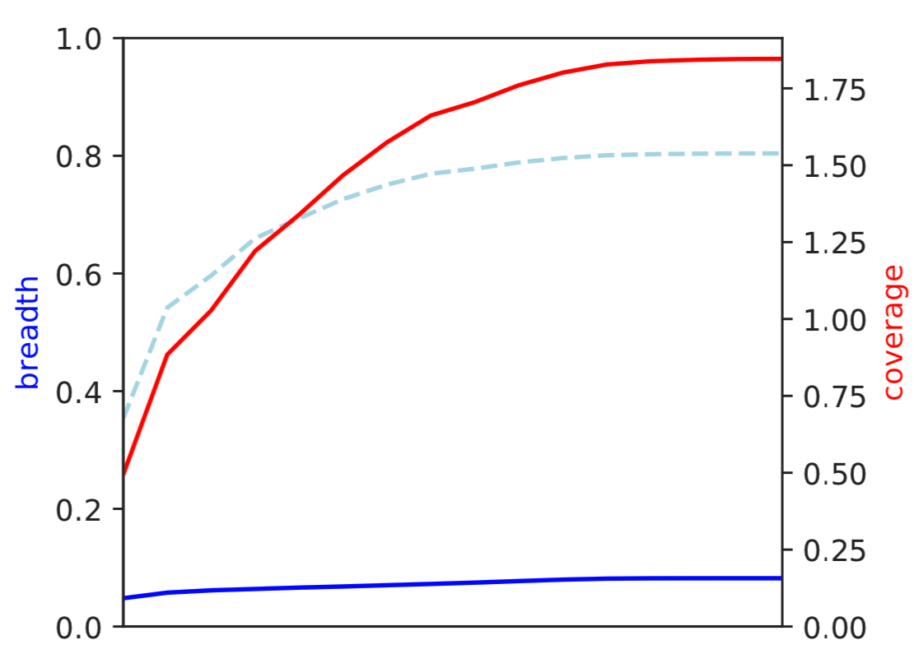

Breadth of coverage (blue line), coverage depth (red line), and expected breadth of coverage given the depth of coverage (dotted blue line) versus the minimum ANI of mapped reads. Coverage depth continues to increase while breadth of plateaus, suggesting that all regions of the reference genome are not present in the reads being mapped.

2) Genome-wide microdiversity metrics
++++++++++++

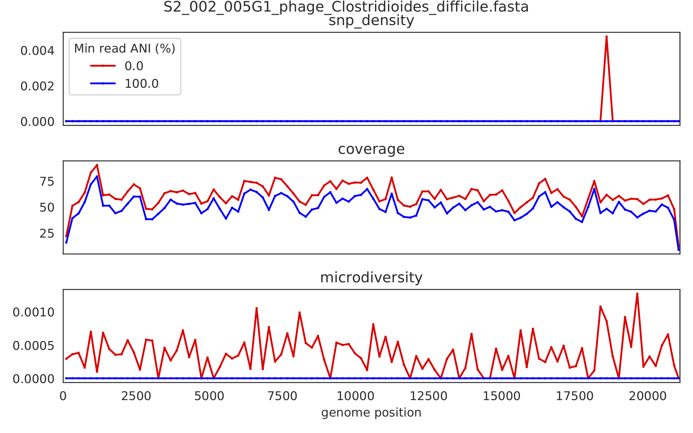

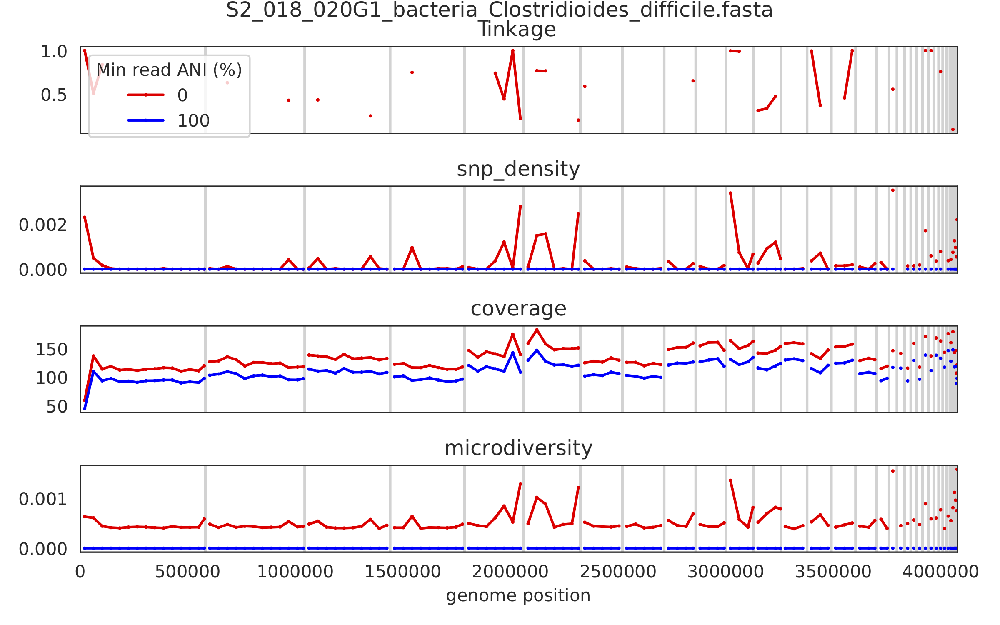

SNV density, coverage, and nucleotide diversity. Spikes in nucleotide diversity and SNV density do not correspond with increased coverage, indicating that the signals are not due to read mis-mapping. Positions with nucleotide diversity and no SNV-density are those where diversity exists but is not high enough to call a SNV

3) Read-level ANI distribution
++++++++++++

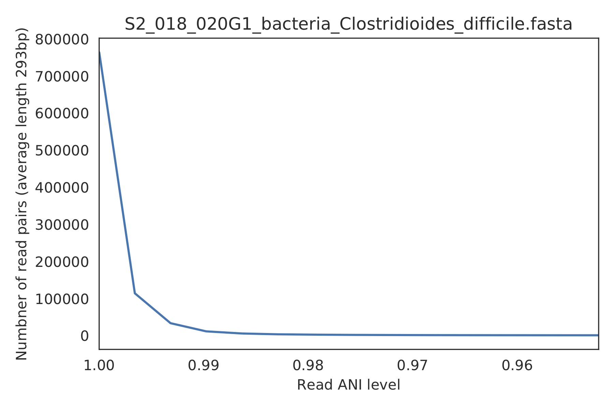

Distribution of read pair ANI levels when mapped to a reference genome; this plot suggests that the reference genome is >1% different than the mapped reads

4) Major allele frequencies
++++++++++++

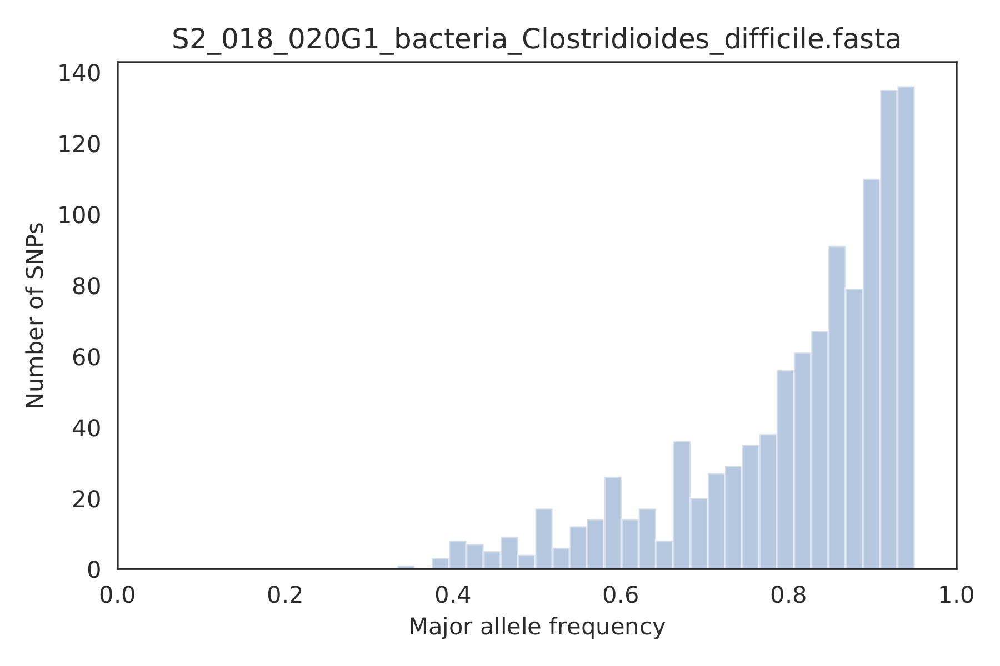

Distribution of the major allele frequencies of bi-allelic SNVs (the Site Frequency Spectrum). Alleles with major frequencies below 50% are the result of multiallelic sites. The lack of distinct puncta suggest that more than a few distinct strains are present.

5) Linkage decay
++++++++++++

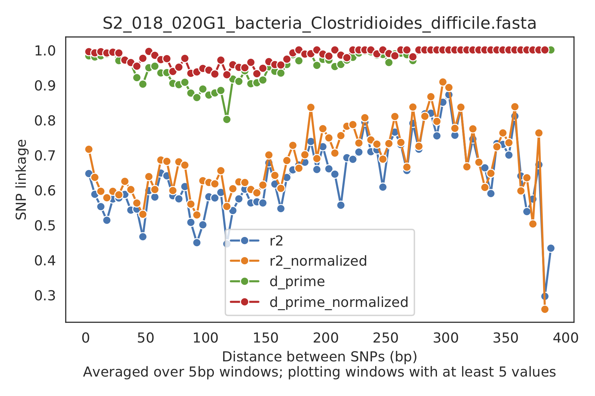

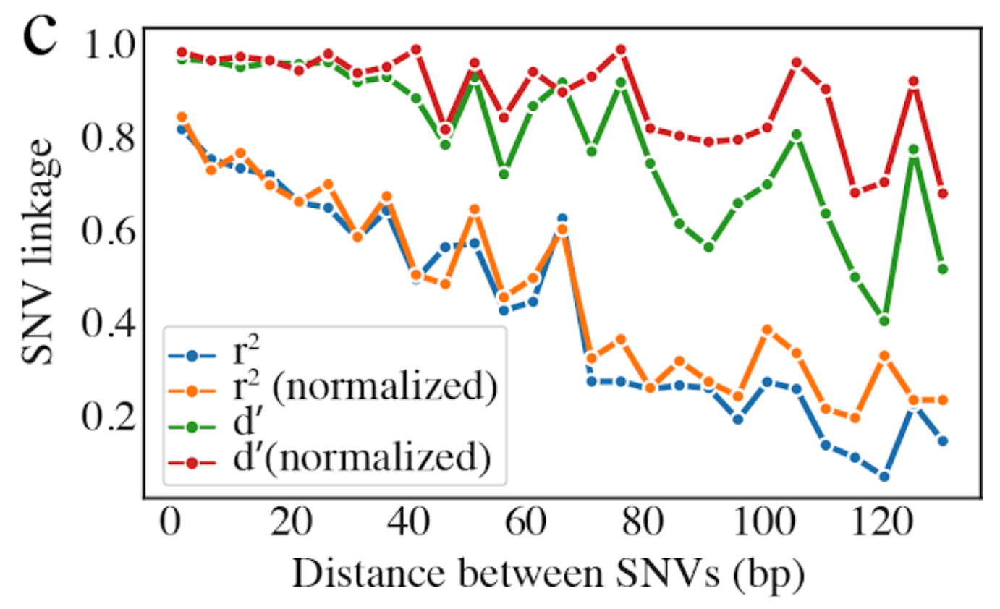

Metrics of SNV linkage vs. distance between SNVs; linkage decay (shown in one plot and not the other) is a common signal of recombination.

6) Read filtering plots
++++++++++++

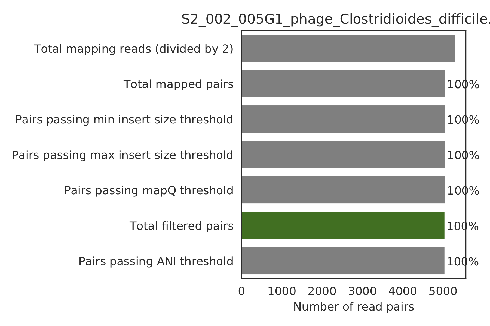

Bar plots showing how many reads got filtered out during filtering. All percentages are based on the number of paired reads; for an idea of how many reads were filtered out for being non-paired, compare the top bar and the second to top bar.

7) Scaffold inspection plot (large)
++++++++++++

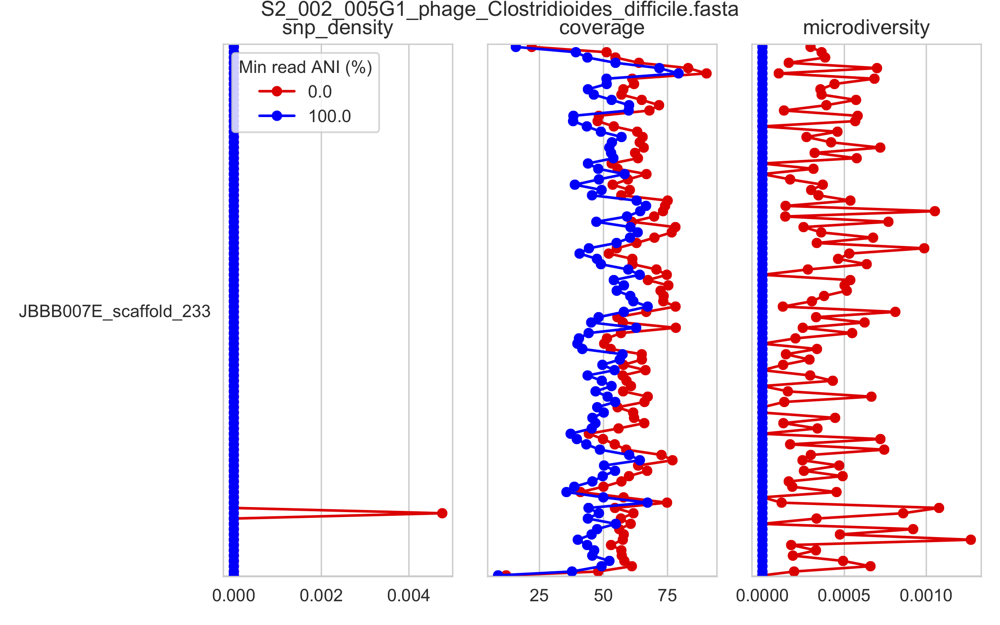

This is an elongated version of the genome-wide microdiversity metrics that is long enough for you to read scaffold names on the y-axis

8) Linkage with SNP type (GENES REQUIRED)
++++++++++++

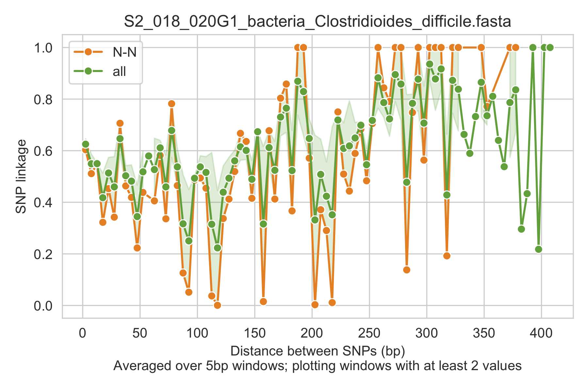

Linkage plot for pairs of non-synonymous SNPs and all pairs of SNPs

9) Gene histograms (GENES REQUIRED)
++++++++++++

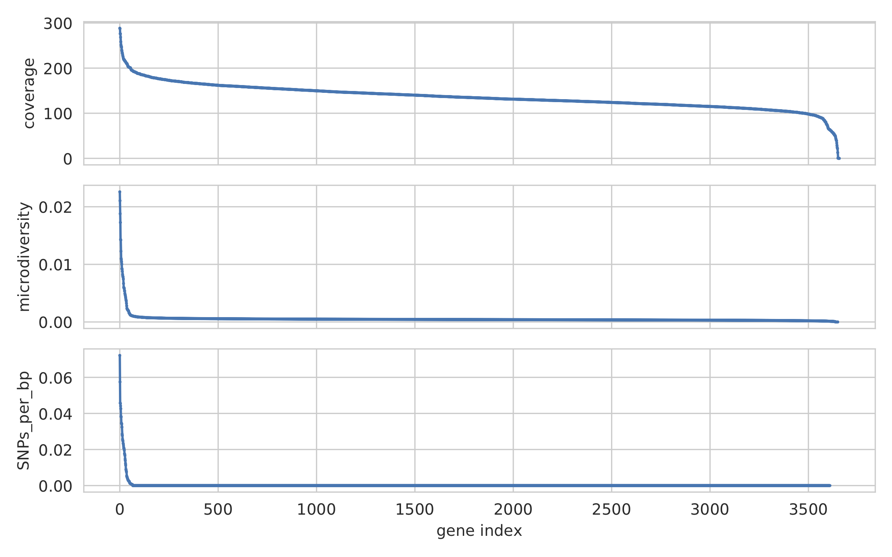

Histogram of values for all genes profiled

10) Compare dendrograms (RUN ON COMPARE; NOT PROFILE)
++++++++++++

.. figure:: images/ExampleIS_plots/Example10.png
  :width: 800px
  :align: center

A dendrogram comparing all samples based on popANI and based on shared_bases.
