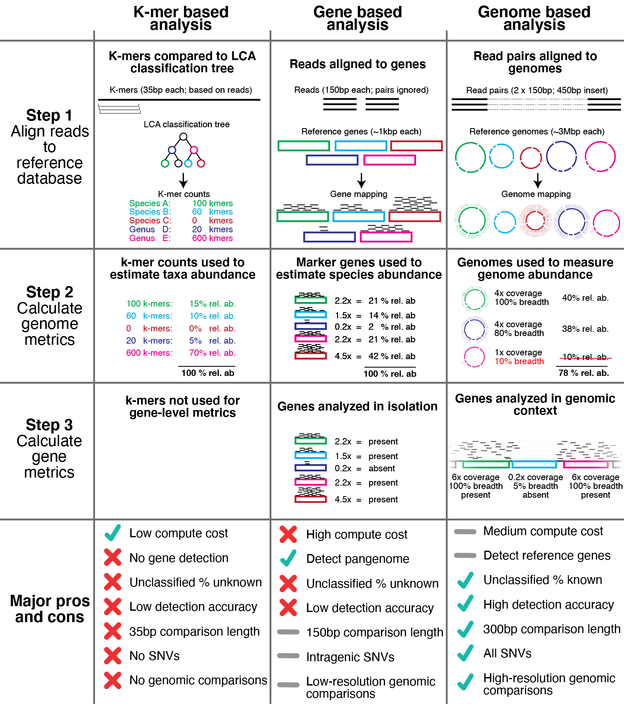
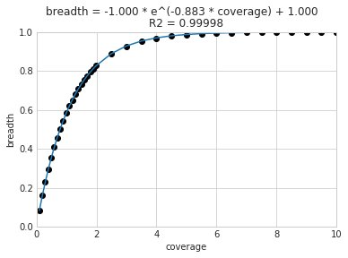
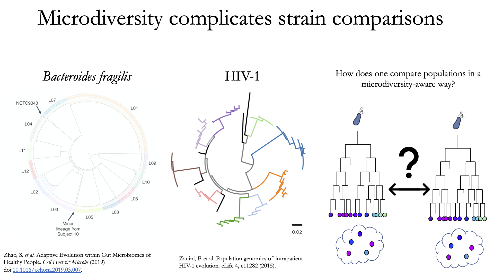
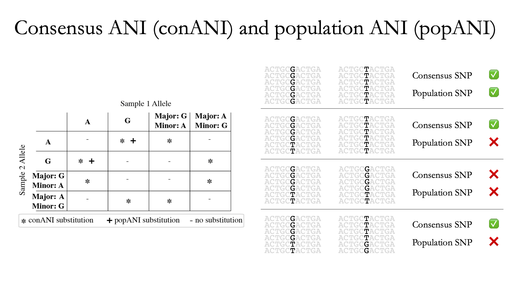
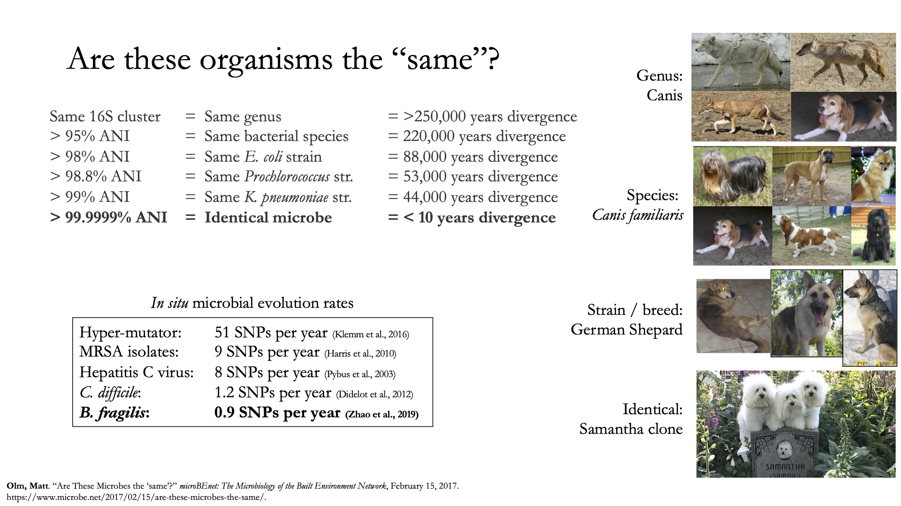

Important concepts
==========================

There are a number of things to be aware of when performing metagenomic analysis with inStrain. This page will address the following key concepts:

**1. An overview of inStrain and the data it generates.** A brief introduction to microbial population genomics.

**2. Representative genomes and their utility.** InStrain runs on "representative genomes"; this section describes what they are and the benefit of using them.

**3. Picking and evaluating representative genomes.** Some things to think about when picking and mapping to representative genomes.

**4. Establishing and evaluating genome databases.** Some things to think about when dereplicating genomes to create a genome database.

**5. Handling and reducing mis-mapping reads.** Ways to ensure that sequencing reads align to the correct genomes.

**6. Detecting organisms in metagenomic data.** Determining whether an organism is "present" in a sample is more complicated than meets the eye.

**7. Strain-level comparisons and popANI.** A description of how inStrain performs detailed strain-level comparisons with the popANI metric.

**8. Thresholds for determining "same" vs. "different" strains.** How similar do strains need to be for them to be considered identical?

**9. Importance of representative genomes when calculating popANI**. Appropriate representative genomes are need for popANI to work correctly.

**10. Using inStrain for gene-based functional analysis.** Some ways to tie inStrain results to gene-based functional questions.

**11. Reducing inStrain resource usage.** Tips to reduce inStrain run-time and RAM usage.

1. An overview of inStrain and the data it generates
++++++++++++++++++++++++++++++++++++++++++++++++++++++

InStrain is a program for microbial metagenomic analysis. When you sequence any microbial genome(s), you sequence a population of cells. This population may be a nearly clonal population grown up from an isolate in a culture flask, or a highly heterogeneous population in the real world, but there is always real biological genetic heterogeneity within that population. Every cell does not have the same genotype at every single position. **InStrain can determine organism presence / absence in a community, measure and interrogate the genetic heterogeneity in microbial population, and perform detailed comparisons between organisms in different samples.**

A community is a collection of taxa in a metagenome. After mapping your metagenomic reads to a set of representative genomes, inStrain can generate a number of metrics that help understand community composition. These include the percentage of reads that map to your representative genome database, the abundance of each microbe in the community, and a detailed picture of the organisms that are present or absent (measured using :term:`breadth` of coverage, expected breadth of coverage, and coverage s.e.m).

A population is the collection of cells that make up an individual taxa in a community. After mapping your metagenomic reads to a set of representative genomes, inStrain can generate a number of metrics characterizing the **population-level diversity** of each detected organism. These metrics include :term:`nucleotide diversity`, :term:`SNSs<SNS>` and :term:`SNVs<SNV>`, :term:`linkage`, :term:`pN/pS`, :term:`iRep`, and others. Most metrics are calculated on the gene level, scaffold level, and genome level.

Strain-level comparisons between populations in different communities are notoriously different to perform with high accuracy. After profiling the communities of metagenomic samples, inStrain can compare the populations in the different communities in a highly-accurate manner by taking into account the population-level diversity. This analysis reports comparison metrics including the percentage of the genome covered in each sample, :term:`popANI`, :term:`conNI`, and the locations of all differences between strains.

.. figure:: images/OverviewFigure1_v1.4.png
  :width: 400px
  :align: center

The above figure provides a conceptual overview of the steps involved when running inStrain.

2. Representative genomes and their utility
+++++++++++++++++++++++++++++++++++++++++++++++++

:term:`Representative genomes<Representative genome>` are genomes that are chosen to represent some group of taxa, and they are the base unit of inStrain-based metagenomic analyses. If one wanted to study the species-level composition of a community with inStrain they would use a set of :term:`Species representative genomes<Species representative genome>` (SRGs), but :term:`Representative genomes<Representative genome>` can also be used at more specific taxonomic levels. They are similar to OTUs in 16S-based analysis. There are some things to be aware of when using :term:`Representative genomes<Representative genome>`, including ensuring that they truly represent the taxa they are meant to, but using them has several advantages over other common approaches.

The above figure shows a visual representation of k-mer based metagenomic analysis, gene-based metagenomic analysis, and :term:`Representative genome` based metagenomic analysis. Advantages include the ability to align full read pairs to target sequences, use the entire genome to determine presence and absence (significantly improving detection accuracy; see :doc:`benchmarks` for proof), and perform high-resolution comparisons, among other things.

A collection of :term:`representative genomes<Representative genome>` is referred to as a :term:`Genome database`. :term:`Genome databases<Genome database>` can be downloaded from public repositories, generated via de novo sequence assembly and binning, or a combination of the two. It is important to ensure that each genome in the :term:`Genome database` is distinct enough from other genomes in the database to avoid mapping confusion, and by mapping to all genomes in a :term:`Genome database` simultaneously (competitively) one can significantly reduce the number of mis-mapped reads overall.

.. figure:: OverviewFigure2_v1.1.png
  :width: 400px
  :align: center

The figure above provides a visual overview of options for generating :term:`Genome databases<Genome database>` for use with inStrain. For technical details on how this is done, see :doc:`user_manual`. For a pre-generated Genome database for immediate download, see :doc:`tutorial`.

3. Picking and evaluating representative genomes
++++++++++++++++++++++++++++++++++++++++++++++++++++++

:term:`Representative genomes<Representative genome>` are typically chosen by first clustering a set of genomes using some :term:`ANI` threshold, and second picking a single genome to represent each cluster. Choosing :term:`ANI` thresholds are discussed in the section below. A good :term:`Representative genome` is high quality, contiguous, shares a high degree of gene content with the taxa it is meant to represent, and has a similar :term:`ANI` to all genomes it's meant to represent. The program `dRep <https://drep.readthedocs.io/en/latest/>`_ is commonly used to pick representative genomes, and it `uses a scoring system to score each genome and pick the genome with the highest score. <https://drep.readthedocs.io/en/latest/choosing_parameters.html#choosing-representative-genomes>`_

Running ``inStrain profile`` will generate a plethora of information about each :term:`Representative genome` detected in your sample (see :doc:`example_output`). This information can be used to determine how good of a fit each representative genome is to the true population that it is recruiting reads from. Helpful metrics are mean read ANI, reference conANI, reference popANI, and breadth vs. expected breath. If there are regions of the genome with much higher coverage than the rest, it is likely that that region is recruiting reads from another population (:term:`mismapped read`). Looking at these wavy coverage patterns can be confusing, however. Here is a `link <http://merenlab.org/2016/12/14/coverage-variation/>`_ for more information on this phenomenon.

One way of increasing the similarity between a :term:`Representative genome` and the organisms in your sample is to assemble genomes from your sample directly. Something to keep in mind is that when multiple closely related genomes are present in a sample, the assembly algorithm can break and you can fail to recover genomes from either organism. A solution to this problem is to assemble and bin genomes from all metagenomic samples individually, and dereplicate the genome set at the end. For more information on this, see the publication `"dRep: a tool for fast and accurate genomic comparisons that enables improved genome recovery from metagenomes through de-replication" <https://www.nature.com/articles/ismej2017126>`_

4. Establishing and evaluating genome databases
++++++++++++++++++++++++++++++++++++++++++++++++++++++

:term:`Genome databases<Genome database>` are typically created by clustering a set of genomes using some :term:`ANI`  threshold using the program dRep. `The dRep documentation describes some considerations to think about when choosing an ANI threshold <https://drep.readthedocs.io/en/latest/choosing_parameters.html#choosing-an-appropriate-secondary-ani-threshold>`_. The most common thresholds are 95% :term:`ANI`, which represents species-level clustering (`Olm mSystems 2020 <https://msystems.asm.org/content/5/1/e00731-19>`_), and 98% ANI, which is about the most stringent threshold recommended. **Using either of these thresholds is generally a safe bet**, and which threshold you choose depends on the level of resolution you'd like to perform your analysis at. These thresholds are ensure that genomes are distinct enough from each other, but not too distinct. Details on why this is important are below.

a) Ensure that genomes are distinct from one another.
******************************************************

.. note::

  When genomes share stretches of identical sequence, read mapping software cannot reliably determine which genome a read should map to. The exact level of how distinct genomes need to be depends on the read length and the heterogeneity of differences across the genome, but **having a maximum of 98% ANI between all genomes in the :term:`Genome database` is a good rule of thumb.**

When mapping to a :term:`Genome database`, if bowtie2 finds a read that maps equally well to multiple different positions in your :term:`fasta file` it will randomly choose one of the two positions to place the read at. This is the best thing it could do, as you don't want reads "duplicated" and mapped to multiple positions, but it also means that you really don't want to have multiple positions in your .fasta file that are identical. The reason we go through the hassle of dereplication to generate a :term:`Genome database` is to limit the number of positions in which the alignment algorithm cannot tell where the read should actually map to, and this is why we can't just map to all possible genomes.

To determine how distinct genomes need to be to avoid having identical regions, we performed a simple experiment. We mapped to a randomly selected genome in isolation, and in the context of many other genomes in a :term:`Genome database` dereplicated at 99.8% ANI. We then looked for reads that mapped to the genome of interest when mapping to that genome individually, but mapped elsewhere when mapping in the context of the entire :term:`Genome database`. The results from this experiment are displayed below.

.. figure:: images/RefFig2.png
  :width: 400px
  :align: center

Each dot represents a genome in the full :term:`Genome database`, the position on the x-axis indicates that genome's ANI to the genome of interest (orange dot), and the position on the y-axis indicates the number of reads that were "stolen" from the genome of interest (stolen reads are those that mapped to the genome of interest when mapped in isolation, but mapped to a different genome when mapped in the context of the entire :term:`Genome database`). As you can see, the more closely related an alternate genome is to a genome of interest, the more likely it is to steal reads. This makes sense, because assuming that the genomes represented by blue dots are not actually present in the sample (likely true in this case), the only way these genomes have reads mapped to them is by having regions that are identical to the genome that is actually present in the sample. In fact, you can even calculate the probability of having an identical region as long as a pair of reads (190bp in this case; 2 x 95bp) based on the genome ANI using the formula:

.. math::

  Probability of identical 190bp fragment = (genome ANI) ^ 190.

This simple formula was used to generate the black dotted line in the figure above. The line fits observed trend remarkably well, providing pretty compelling evidence that simple genome-ANI-based read stealing explains the phenomena. To be sure though, we can did final check based on :term:`mapQ score`. Reads that map equally well to multiple different locations in a :term:`fasta file` always get a MapQ score of 0-2. Thus, by filtering out reads with MapQ scores < 2, we can see reads that map uniquely to one genome only. Below we will re-generate the above figure while only including reads with :term:`mapQ scores<mapQ score>` above 2.

.. figure:: images/RefFig3.png
  :width: 400px
  :align: center

Just as we suspected, reads no longer map to alternate genomes at all. This provides near conclusive evidence that the organisms with these genomes are not truly in the sample, but are merely stealing reads from the genome of the organism that is there by having regions of identical DNA. For this reason it can be smart to set a minimum MapQ score of 2 to avoid mis-mapping, but at the same time, look at the difference in the number of reads mapping to the correct genome when the MapQ filter is used (compare the y-axis in the first and second figure)- 85% of the reads are filtered out. Using MapQ filters is a matter of debate depending on your specific use-case.

The data above can also be used to evaluate the most stringent threshold that can be used for dereplication. With 190bp reads (used in the figure above), we can see that read stealing approaches 0 at ~98% ANI. We can also plug this into the formula above to see that there is a ~2% change of genomes that are 98% ANI from each other sharing a 190bp identical stretch of DNA (``0.98 ^ 190 = 0.02``). This is how we arrived at our recommended minimum of 98% ANI. However it is important to note that longer reads change the formula and differences between genomes are not uniformly spread across the genome. This is a complicated question and 98% ANI is just a good rule of thumb.

A symptom of having a :term:`Genome database` in which genomes are too similar to one another is detecting lots of closely related organisms at similar abundance levels in samples.

b) Ensure that genomes aren't too distinct from one another.
*************************************************************

.. note::

  When representative genomes are too distinct from the sample population they can have trouble with read mapping. The exact level of how similar genomes need to be depends on a number of factors, but **a having a minimum of 95% ANI between all genomes in the genome database (representing species-level dereplication) is a good rule of thumb.**

Genomes need to be similar enough to the population being mapped that they can properly recruit reads. If one were to generate a :term:`Genome database` using an ANI threshold of 85% ANI, for example, implicit in that choice is the requirement that organisms which share ≥85% ANI to a representative genome will have their reads mapped to that genome. This begs the question- how similar do reads have to be to a genome for bowtie2 to map them? The answer is "it's complicated":

.. figure:: images/Fig5.png
  :width: 400px
  :align: center

In the above example we generated synthetic reads that have a mean of 90% ANI to the reference genome. We then mapped these reads back to the reference genome and measured the ANI of mapped reads. Critically, the density of read ANI is not centered around 90% ANI, as it would be if all reads mapped equally well. The peak is instead centered at ~91% ANI, with a longer tail going left than right. This means that reads which have <92% ANI to the reference genome sometimes don't map at all. Sometimes they do map, however, as we see some read pairs mapping that have ~88% ANI. The reason for this pattern is because **bowtie2 doesn't have a stringent ANI cutoff, it just maps whatever read-pairs it can**. Where the SNPs are along the read, whether they're in the seed sequence that bowtie2 uses, and other random things probably determine whether a low-ANI read pair maps or not. Thus, while bowtie2 can map reads that are up to 86% ANI with the reference genome, 92% seems to be a reasonable minimum based on this graph.

However, this does not mean that a representative genome that has 92% ANI to an organism of interest will properly recruit all it's reads. ANI is calculated as a genome-wide average, and some regions will have more mutations than others. This is why the figure above has a wide distribution. Further, genomes that share 92% ANI have diverged from each other for a very long time, and likely have undergone changes in gene content as well. Recent studies have shown that organisms of the same species usually share >= 95% ANI, and that organisms of the same species share much more gene content than organisms from different species (`Olm mSystems 2020 <https://msystems.asm.org/content/5/1/e00731-19>`_). In sections below we also show that a buffer of ~3% ANI is needed to account for genomic difference heterogeneity, meaning that genomes dereplciated at 95% should be able to recruit reads at 92% ANI (the minimum for bowtie2). **Thus for a number of reasons 95% ANI is a good minimum ANI threshold for establishing genome databases.**

A symptom of having a :term:`Genome database` in which genomes are too distinct from one another is genomes having low mean read ANI and :term:`breadth`, and having an overall low percentage of reads mapping.

c) Ensure that all microbes in a sample have an appropriate representative genome.
***********************************************************************************

Populations with appropriate representative genomes will be most accurately profiled, and populations that do not have a representative genome in the genome database will be invisible. **Using a combination of de novo assembly and integration with public databases can result in genome databases that are both accurate and comprehensive.** Instructions for how to do this are available in the :doc:`tutorial` and :doc:`user_manual`. A great way to determine how complete your :term:`Genome database` is is to calculate the percentage of reads that map to genomes in your database. The higher this percentage, the better (expect ~20-40% for soil, 60-80% for human microbiome, and 90%+ for simple, well defined communities).

5. Handling and reducing mis-mapping reads
+++++++++++++++++++++++++++++++++++++++++++

As discussed above, a major aspect of using and establishing :term:`Genome databases<Genome database>` with inStrain is reducing the number of reads that map to the wrong genome. When metagenomic sequencing is performed on a community, reads are generated from each population in that community. The goal of read mapping is to assign each read to the genome representing the population from which the read originated. When a read maps to a genome that does not represent the population from which the read originated, it is a mis-mapped read. Read mis-mapping can happen when a read maps equally well to multiple genomes (and is then randomly assigned to one or the other) or when a read from a distantly-related population maps to an inappropriate genome. Read mis-mapping can be reduced using a number of different techniques as discussed below.

**Reducing read mis-mapping with competitive mapping**

Competitive mapping is when reads are mapped to multiple genomes simultaneously. When we establish and map to a :term:`Genome database` we are performing competitive mapping. When bowtie2 maps reads, by default, it only maps reads to a single location. That means that if a read maps at 98% ANI to one genome, and 99% ANI to another genome, it will place the read at the position with 99% ANI. If the read only maps to one scaffold at 98% ANI, however, bowtie2 will place the read there. Thus, by including more reference genome sequences when performing the mapping, reads will end up mapping more accurately overall. Ensuring that you have the most comprehensive genome set possible is a great way to reduce read mis-mapping via competitive mapping.

**Reducing read mis-mapping by adjusting min_read_ani**

InStrain calculates the ANI between all read-pairs and the genomes they map to. The inStrain profile parameter ``-l`` / ``--min_read_ani`` dictates the minimum ANI a read pair can have; all pairs below this threshold are discarded. Adjusting this parameter can ensure that distantly related reads don't map, but setting this parameter to be too stringent will reduce the ability of a genome to recruit reads with genuine variation.

.. figure:: images/Fig4.png
  :width: 400px
  :align: center

For the figure above synthetic read pairs were generated to be 98% ANI to a random E. coli genome, reads were mapped back to that genome, and the distribution of ANI values of mapped reads was plotted. Most read pairs have 98%, as expected, but there is a wide distribution of read ANI values. This is because differences between reads and genomes are not evenly spread along the genome, a fact that is even more true when you consider that real genomes likely have even more heterogeneity in where SNPs occur than this synthetic example. You really don't want reads to fail to map to heterogeneous areas of the genome, because those areas with more SNPs are potentially the most interesting. Based on the figure above and some other confusing tests that aren't included in this documentation, it seems that **the minimum read pair ANI should be 2-3% lower than the actual difference between the reads and the genome to account for genomic heterogeneity.** Thus a ``--min_read_ani`` of 92% should be used when reads are expected to map to genomes that are 95% ANI away, for example when using :term:`Species representative genomes<Species representative genome>`.

.. warning::
  The inStrain default is 95% minimum read pair ANI, which is ideal in the case that you've assembled your reference genome from the sample itself. If you plan on using inStrain to map reads to a :term:`Genome database` of :term:`Species representative genome`s, you should lower the minimum read-pair ANI to ~92% (note that using the ``--database_mode`` flag automatically adjusts ``--min_read_ani`` to 0.92)

**Reducing read mis-mapping by adjusting MapQ**

:term:`mapQ score`s are numbers that describe how well a read maps to a genome. InStrain is able to set a minimum read-pair mapQ score using the parameter ``--min_mapq``. MapQ scores in general are confusing, without consistent rules on how they're calculated using different mapping programs, but the values 0-2 have special meaning. **If a read maps equally well to multiple positions it is given a mapQ score of 1 or 2.** Thus by setting ``--min_mapq`` to 2, you can remove all reads that map equally well to multiple positions (:term:`multi-mapped read`). Remember that with competitive mapping a read that maps equally well to multiple positions will be randomly assigned to one, giving that read a ≥50% chance of being mis-mapped.

Whether or not you should set ``--min_mapq`` to 2 is a difficult decision. On one hand these reads have a high probability of being mis-mapped, which is not ideal, but on the other hand doing this mapQ filtering can result in filtering out lots of reads (see figures in the above section "Establishing and evaluating genome databases"). One way of thinking about this is by imagining two genomes A and B that are very distinct from one another but share an identical transposon. If the population represented by genome A and not genome B is present in a sample, without mapQ filtering you'll see genome A having a :term:`breadth` of 100% and genome B having a :term:`breadth` of ~1%. If genome A is at 100X coverage you'll see the coverage across most of the genome at 100x, and at the transposon it will be at 50x. Genome B will have 0x coverage across most of the genome, and the transposon will be at 50x coverage. The benefit of this scenario is that we are still able detect that genome A has the transposon; the downside is that it that genome B is erroneously detected has having a transposon present in the sample (however when using recommended threshold of 50% :term:`breadth` to determine detection genome B will still correctly be identified as not being present in the sample). Performing mapQ filtering on the above situation will result in genome A having a breadth of 99%, 0x coverage at the transposon, and no reads mapping to genome B. The benefit of this scenario is that we properly detect that no reads are mapping to genome B; the downside is that we incorrectly think that genome A does not have a transposon in this sample.

.. note::

  In conclusion, filtering reads by :term:`mapQ score` is not ideal for a number of reasons. It is best to instead reduce the number of multi-mapped reads using the advice in the sections above to make it so ``--min_mapq`` filtering isn't necessary.

6. Detecting organisms in metagenomic data.
+++++++++++++++++++++++++++++++++++++++++++++++++

.. note::

  Mis-mapping can fool abundance-based presence/absence thresholds. We recommend using a 50% :term:`breadth` threshold to determine presence/absence instead.

A critical first step in metagenomic analysis is determining which :term:`Representative genomes<Representative genome>` are "present" or "absent" (and therefore the microbial populations they represent as well). This is actually more complex than meets the eye, mostly due to :term:`multi-mapped reads<multi-mapped read>` and :term:`mismapped reads<mismapped read>`. Details on these phenomena are discussed above, but the upshot is that **just because a genome has reads mapping to it does not mean that that genome is actually present in a sample.**

Many studies determine presence/absence based on metrics like :term:`coverage` or relative abundance. This isn't great though, since there can easily be substantial numbers of mis-mapped reads. There are countless examples of a genome being detected at 100x :term:`coverage` and 2% :term:`relative abundance`, but when looking at the mapping it is discovered that all reads are mapped to a single prophage on the genome. The problem with these metrics is that they are genome-wide averages, so they cannot account for cases where substantial numbers of reads are map to a small region of the genome. Most would agree that detecting solely a prophage or transposon on a genome should not count as that genome being "present", so we need metrics beyond :term:`coverage` and 2% :term:`relative abundance` to determine presence / absence. See :doc:`benchmarks` for more real-world examples of this phenomena.

A great metric for determining presence/absence is :term:`breadth`, the percentage of a genome that's covered by at least one read. Using :term:`breadth` to determine presence/absence allows the user to account for the problems above. Deciding on an appropriate breadth threshold requires the user to answer the question "How much of the genome do I need to have detected in a sample before I am confident that it's actually present"? The answer to this question depends on the particular study details and questions, but we can use data to help us decide on a rational breadth cutoff.

.. figure:: images/SpeciesDeliniation_Figure1_v6.3.png
  :width: 400px
  :align: center

The figure above shows the expected genome overlap between genomes of various ANI values from different environments (adapted from `"Consistent metagenome-derived metrics verify and define bacterial species boundaries" <https://www.biorxiv.org/content/early/2019/05/24/647511.full.pdf>`_). As you can see, genomes from that share >95% ANI tend to share ~75% of their genome content. Therefore, using a breadth detection cutoff of somewhere around 50-75% seems to be reasonable when using :term:`Species representative genome` s. **In my experience using a 50% breadth cutoff does a great job of ensuring that genomes are actually present when you say they are, and leads to very few false positives.** It's exceedingly rare for mis-mapping to lead to >50% genome breadth. See :doc:`benchmarks` for real-world examples of the 50% breadth threshold in action.

A caveat of using a breadth threshold is that it requires thousands of reads to map to a genome for it to be considered present. This makes it less ideal for samples with low sequencing depth. To determine the :term:`coverage` needed to detect a genome at some :term:`breadth`, we performed an experiment based on synthetic E. coli  and C. albicans reads). By generating reads, subsetting them to a number of different total read numbers, and mapping them back to the genome, we generated the following figure

This figure allows us to visually see the relationship between coverage and breadth **when reads are mapped randomly across the genome**. To achieve a 50% breadth an organism needs to have just under 1x coverage. At over 6x coverage, all organisms should have ~100% breadth. This data also allowed us to fit a curve to calculate the following formula:

.. math::

    breadth = 1 - e ^{-0.883  *  coverage}

Applying this formula allows inStrain to calculate and report :term:`expected breadth` for a given coverage value. **Effective use of expected breadth can allow users to lower their breadth thresholds and still have confidence in determining presence/absence**. Imagine that you detect an organism at 10x coverage and 85% breadth. The :term:`expected breadth` at 10x coverage is 100%, but you only have 85% breadth. This means that 15% of your genome is likely not in the reads set, and that your representative genome has genome content that is 15% different from the organism in your sample. Now imagine that you detect an organism at 3x coverage with 85% breadth. The :term:`expected breadth` and actual breadth are approximately the same now, meaning that reads and randomly aligning to all parts of the genome and you likely have a very dialed in representative genome. Now imagine you detect organism A with 10% breadth and 0.1x coverage, and organism B with 10% breadth and 10x coverage. Both organisms have the same breadth, but organism A is much more likely to be actually present in your sample. That's because while few reads overall are mapping, they're mapping all across the genome in a random way (you know this because breadth is about equal to expected breadth), which is indicative of a true low abundance population. Organism B, however, should be abundant enough for reads to map all over the genome (expected breadth is 100%), but reads are only mapping to 10% of it. This indicates that no matter how deeply you sequence you will not see the rest of organism B's genome, and the 10% of it that you are seeing is likely due to mis-mapping.

7. Strain-level comparisons and popANI.
+++++++++++++++++++++++++++++++++++++++++++++++++

InStrain is able to perform detailed, accurate, microdiversity-aware strain-level comparisons between organisms detected in multiple metagenomic samples. The is done using the command ``inStrain compare`` on multiple samples that have been profiled using the command ``inStrain profile``, and technical details on how this is done is available in the :doc:`user_manual`.

To understand why "microdiversity-aware" genomic comparisons are important, consider the fact that all natural microbial populations have some level of genomic heterogeneity present within them.

The image above incorporates data from `Zhao et. al. 2019 <https://doi.org/10.1016/j.chom.2019.03.007>`_ and `Zanini et. al. 2015 <https://doi.org/10.7554/eLife.11282>`_ (left and middle phylogenetic trees). In each case different colors represent different individuals, and each leaf represents an individual isolate. You can see from these data that although each individual has a distinct microbial population, there is substantial diversity within each individual as well (referred to as intraspecific genetic variation (within species), intrapatient genetic variation (within patient), or :term:`microdiversity`). Knowledge of this fact leads to the question- **how does one accurately compare populations that have intraspecific genetic variation?** Some common approaches include comparing the "average" genome in each sample (the consensus genome) or comparing a number of individual isolates. See :doc:`benchmarks` for some data on how well these approaches hold up.

InStrain performs microdiversity-aware comparisons using the metric :term:`popANI`, depicted above, which is also reported alongside the more common consensus-based ANI metric :term:`conANI`. The calculation of :term:`popANI` and :term:`conANI` is not complicated once you understand it (really), but describing can be tricky, and the simplest way of describing it is with examples like those displayed above.

While not depicted in the above figure, the first step of calculating :term:`conANI` and :term:`popANI` is identifying all positions along the genome in which both samples have ≥5x coverage. This number is reported as the ``compared_bases_count``, and it describes the number of base-pairs (bp) that are able to be compared. Next, inStrain goes through each one of these comparable base-pairs and determines if there is a conANI substitution at that position and/or if there is a popANI substitution at that position. The left half of the above figure describes the conditions that will lead to popANI and conANI substitutions. If both samples have the same major allele (e.g. the most common base at that position is the same in both samples), no substitutions will be called. If samples have different major alleles (e.g. the most common base in sample 1 is A, and the most common base in sample 2 is C), a conANI substitution will be called. If there are **no alleles that are shared between the two samples**, major or minor, a popANI substitution will be called. The calculations that determine whether or not a base is considered "present" as a minor allele in a sample (vs. it just being a sequencing error) are discussed in the :doc:`user_manual`.

On the right side of the above figure we see several examples of this in action. In the top row there are no alleles that are the same in both samples, therefore the site will count as both a conANI SNP and a popANI SNP. In the second row the consensus allele is different in both samples (its G in the sample on the left and T in the sample on the right), so a conANI SNP will be called. However the samples DO share an allele (T is present in both samples), so this will NOT be considered a popANI substitution. In the third row both samples have the same consensus allele and share alleles, so no substitutions are called. In the last row the samples have different consensus alleles (G on the left and T on the right), so a conANI substitution will be called, but there is allele overlap between the samples (both samples have G and T) so a popANI substitution will NOT be called.

Once we have the ``compared_bases_count``, number of conANI SNPs, and number of popANI SNPs, calculation of :term:`conANI` and :term:`popANI` is trivial.

.. math::

  popANI =  ({compared bases count} - {popANI snps}) / {compared bases count}

  conANI =  ({compared bases count} - {conANI snps}) / {compared bases count}

.. note::

  Notice that ``compared_bases_count`` is integral to conANI and popANI calculations. It essentially determines the "denominator" in the calculations, as it let's you know how bases were compared in the calculation. Attempting to calculate :term:`conANI` and :term:`popANI` using SNP-calling data from other programs will likely leave out this critical information. Remember- ``compared_bases_count`` is a measure of how many bases have at least 5x coverage in BOTH samples. Consideration of ``compared_bases_count`` is critical to ensure that :term:`popANI` isn't high simply because one or both sample's doesn't have high enough coverage to detect SNPs

8. Thresholds for determining "same" vs. "different" strains.
++++++++++++++++++++++++++++++++++++++++++++++++++++++++++++++++

Once inStrain performs it's strain-level comparisons, one must decide on some threshold to define microbes as being the "same" or "different" strains. The figure above illustrates some common ANI values used for defining various relationships between microbes (top left), some previously reported rates of in situ microbial evolution (bottom left), and estimates of divergence times for various :term:`ANI` thresholds (top left). On the right is an analogy using canine taxonomy.

The figure above illustrates how loose :term:`ANI` thresholds can be used to define relatively broad groups of organisms, for example the genus Canis or the species *Canis Familiaris*. Sub-species taxonomic levels, referred to as strains in the microbe world and breeds in the dog world, describe groups of organisms within particular species. Strain definitions in the microbial world are not consistent, but some example strain ANI thresholds are shown. **There is still generally some variation within strains, however.** This is exemplified by the fact that while dogs of the same breed are similar to one another, they're not **identical** to one another. Similarly, microbes of the same strain based on a 99% ANI definition can have diverged for roughly 44,000 years (based on the in situ mutation rate in bold in the bottom left). Clearly microbes that have diverged for tens of thousands of years are not **identical** to one another. **Thus if we want to know whether samples are linked by a recent microbial transmission event, we need an extremely stringent definition of "same" that is beyond the typical strain level**. Note that the dogs in the bottom right are `clones that truly do represent identical dogs. <https://www.nytimes.com/2018/03/02/style/barbra-streisand-cloned-her-dog.html>`_.

To identify microbes that are linked by a recent transmission event we want the most stringent ANI threshold possible. 99.9999% :term:`ANI`, for example, represents less than 10 years of divergence time and could be a useful metric. Metagenomic sequencing is messy, however, and when working with this level of stringency we need to think about our limit of detection. The :doc:`benchmarks` section contains data on the limit of detection for inStrain using defined microbial communities (see section "Benchmark with true microbial communities") **The conclusion is that 99.999% popANI is a good, highly stringent definition for identical strains that is within the limit of detection for metagenomic analysis.**. In addition to :term:`popANI`, one must also consider the fraction of the genome that was at sufficient coverage in both samples being compared. This value (reported as ``percent_genome_compared``) is more of a judgement call, but we recommend requiring a minimum of 25% or 50% ``percent_genome_compared`` in addition to the :term:`popANI` threshold.

.. note::

  In conclusion, organisms in different samples that are linked by a recent transmission event should have ≥99.999% popANI and ≥50% ``percent_genome_compared``

9. Importance of representative genomes when calculating popANI
++++++++++++++++++++++++++++++++++++++++++++++++++++++++++++++++

InStrain strain-level comparisons are based on mappings to :term:`representative genomes<Representative genome>`. In order for this to work well, however **reads with variation must be able to map to the representative genomes within the ``--min_read_ani`` threshold.** Note that ``inStrain compare`` will use the ``--min_read_ani`` selected during the ``inStrain profile`` commands by default.

Below are a series of plots generated from synthetic data demonstrating this fact. In these plots a reference genome was downloaded from NCBI, mutated to a series of known ANI values, synthetic reads were generated from each of these mutated genomes, and synthetic reads were then mapped back to the original genome.

.. figure:: images/RC_Fig1.png
  :width: 400px
  :align: center

In the above plot the ``--min_read_ani`` is set to 95%. As you can see, when the true ANI value between the genomes is below 98%, popANI values reported by inStrain are not accurate. The reason that this happens is because reads with genuine variation are being filtered out by inStrain, leaving only the reads without variation, which artificially increases the reported :term:`popANI` values. **In sections above we demonstrated that ``--min_read_ani`` should be ~3% looser than the population you'd like to recruit reads from; the same rule applies here.** If you'd like to compare organisms that have a popANI of 95%, your ``--min_read_ani`` needs to be 92%. Here we have a ``--min_read_ani`` of 95%, so we can detect accurate :term:`popANI` values of 98% or above (as shown in the above figure). This phenomena is explored further in the following way.

.. figure:: images/RC_Fig2.png
  :width: 400px
  :align: center

The above figure displays the ``percent_genome_compared`` for each of the comparisons in the first figure in this section. As expected, when comparing genomes of low ANI values with a read-pair ANI threshold of 95%, only a small amount of the genome is actually being compared. This genome fraction represents the spaces of the genome that happen to be the most similar, and thus the inStrain calculated ANI value is overestimated. **The conclusion here is that in order to get an accurate ANI value, you need to set your ``--min_read_ani`` at least 3% below the ANI value that you wish to detect.**

10. Using inStrain for gene-based functional analysis
++++++++++++++++++++++++++++++++++++++++++++++++++++++

The above figure shows a visual representation of k-mer based metagenomic analysis, gene-based metagenomic analysis, and :term:`Representative genome` based metagenomic analysis. As you can see, among the advantages of genome-based metagenomic analysis is the ability to perform context-aware functional profiling.

InStrain does not have the ability to annotate genes. However, inStrain does have the ability to deeply profile all genes in a sample, including analysis of coverage, coverage variation, gene :term:`pN/pS`, nucleotide diversity, individual :term:`SNVs<SNV>`, etc. This gene-level information can then be combined with gene annotations to perform robust functional analysis. Any database can be used for this type of analysis, including `pFam <http://pfam.xfam.org/>`_ for protein domain annotations, `ABRicate <https://github.com/tseemann/abricate>`_ for antibiotic resistance gene annotation, `UniRef100 <https://www.uniprot.org/help/uniref>`_ for general protein annotation, and `dbCAN <http://bcb.unl.edu/dbCAN/>`_ for CAZyme annotation.

For examples of inStrain-based functional annotation in action, see `Table 1 and Figure 6 of the inStrain publication <https://www.biorxiv.org/content/10.1101/2020.01.22.915579v1>`_ and `this GitHub repo focused on COVID-19 population genomics analysis <https://github.com/MrOlm/covid19_population_genomics>`_

11. Reducing inStrain resource usage
+++++++++++++++++++++++++++++++++++++++++++++++++

.. note::

  When mapping to a :term:`Genome database` with more than a handful of genomes make sure to use the flag ``--database_mode``

The two computational resources to consider when running inStrain are the number of processes given (``-p``) and the amount of RAM on the computer (usually not adjustable unless using cloud-based computing).

Using inStrain v1.3.3, running inStrain on a .bam file of moderate size (1 Gbp of less) will generally take less than an hour with 6 cores, and use about 8Gb of RAM. InStrain is designed to handle large .bam files as well. Running a huge .bam file (30 Gbp) with 32 cores, for example, will take ~2 hours and use about 128Gb of RAM. The more processes you give inStrain the longer it will run, but also the more RAM it will use.

In the log folder InStrain provides a lot of information on where it's spending it's time and where it's using it's RAM.

To reduce RAM usage, you can try the following things:

* Use the ``--skip_mm`` flag. This won't profile things on the :term:`mm` level, and will treat every read pair as perfectly mapped. This is perfectly fine for most applications

* Make sure and use the ``--database_mode`` flag when mapping to :term:`genome databases<Genome database>`. This will do a couple of things to try and reduce RAM usage

* Use less processes (``-p``). Using more processes will make inStrain run faster, but it will also use more RAM while doing so