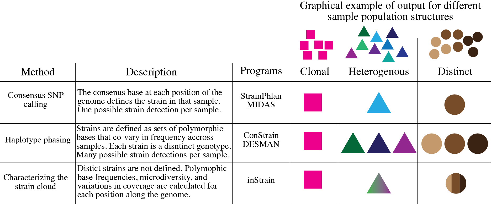

Overview and FAQ
========

Overview
------------

When you sequence any microbial genome(s), you sequence a population of cells. This population may be a nearly clonal population grown up from an isolate in a culture flask, or a highly heterogenous population in the real world, but there is always real biological genetic hetereogeneity within that population - every cell does not have the same genotype at every single position.

**InStrain is a program for measuring, comparing, and interrogating the genetic heterogeneity of microbial populations in and between metagenomic samples.** We refer to these intraspecific differences as "microdiversity"

FAQ (Frequently asked questions)
----------------

How does inStrain compare to other bioinformatics tools for strains analysis?
+++++++++++++++

What can inStrain do?
+++++++++++++++

inStrain includes calculation of nucleotide diversity, calling SNPs (including non-synonymous and synonymous variants), reporting accurate coverage / breadth, and calculating linkage disequilibrium in the contexts of genomes, contigs, and individual genes.

inStrain also includes comparing the frequencies of fixed and segregating variants between sequenced populations with extremely high accuracy, out-performing other popular strain-resolved metagenomics programs.

The typical use-case is to generate a `.bam` file by mapping metagenomic reads to a bacterial genome that is present in the metagenomic sample, and using inStrain to characterize the microdiversity present.

Another common use-case is detailed strain comparisons that involves comparing the genetic diversity of two populations and calculating the extent to which they overlap. This allows for the calculation of population ANI values for extremely similar genomic populations (>99.999% average nucleotide identity).

.. seealso::
  :doc:`installation`
    To get started using the program
  :doc:`module_descriptions`
    For descriptions of what the modules can do
  :doc:`example_output`
    To view example output
  :doc:`preparing_input`
    For information on how to prepare data for inStrain
  :doc:`choosing_parameters`
    For detailed information on how to make sure inStrain is running correctly

When should I use inStrain?
+++++++++++++++

inStrain is intended to be used as a genome-resolved metagenomics approach. Genome-resolved metagenomics involves sequencing and  de novo assembly of the actual microbial genomes present in the sample(s) of interest. It is these microbial genomes, and not microbial genomes derived from reference databases, that we will then use as scaffolds on which to map reads from the sample.

We don't recommend using reference genomes for strain-resolved inferences in metagenomes. This is because reference databases have usually poorly sampled the true extent of microbial diversity below the species level across many environments. Using even partially inaccurate references can lead to inaccurate conclusions about the genetic variation within your samples.

inStrain can be run on individual microbial genomes assembled and binned from a metagenome, sets of de-replicated microbial genomes, or entire metagenomic assemblies at once.

When should I probably not use inStrain?
+++++++++++++++

When you have not assembled genomes from the metagenomic samples you are interrogating; when breadth and coverage of the consensus genome are low; when you wish to compare populations that are <95% ANI with each other; when you are interested in species-level community composition, not intra-population diversity.

How does inStrain work?
+++++++++++++++

The reasoning behind inStrain is that every sequencing read is derived from a single DNA molecule (and thus a single cell) in the original population of a given microbial species. During assembly, the consensus of these reads are assembled into contigs and these contigs are binned into genomes - but by returning to assess the variation in the reads that assembled into the contigs, we can characterize the genetic diversity of the population that contributed to the contigs and genomes.

The basic steps:

1. Map reads to a `.fasta` file to create a `.bam` file

2. Stringently filter mapped reads and calculate coverage and breadth

3. Calculate nucleotide diversity and SNPs

4. Calculate SNP linkage

5. Optional: calculate gene statistics and SNP function

6. Optional: compare SNPs between samples.

What is unique about the way that inStrain compares strains?
+++++++++++++++

Most strain-resolved pipelines compare the dominant allele at each position. If you have two closely related strains A and B in sample 1, with B being at higher abundance, and two closely related strains A and C in sample 2, with C being at higher abundance, most strain comparison pipelines will in actuality compare strain B and C. This is because they work on the principle of finding the dominant strain in each sample and then comparing the dominant strains. inStrain, on the other hand, is able to identify the fact that A is present in both samples. This is because it doesn't just compare the dominant alleles, but compares all alleles in the two populations. See doc:`module_descriptions` and :doc:`choosing_parameters` for more information.

What is a population?
+++++++++++++++

To characterize intra-population genetic diversity, it stands to reason that you first require an adequate definition of "population". inStrain relies mainly on population definitions that are largely technically limited, but also coincide conveniently with possibly biological real microbial population constraints (`link1
<https://msystems.asm.org/content/5/1/e00731-19>`_. `link2<https://www.nature.com/articles/s41467-018-07641-9>`_.). Often, we dereplicate genomes from an environment at average nucleotide identities (ANI) from 95% to 99%, depending on the hetereogeneity expected within each sample - lower ANIs might be preferred with more complex samples. We then assign reads to each genome's population by stringently requiring that combined read pairs for SNP calling be properly mapped pairs with an similarity to the consensus of at least 95% by default, so that the cell that the read pair came from was at least 95% similar to the average consensus genotype at that position. Within environment, inStrain makes it possible to adjust these parameters as needed and builds plots which can be used to estimate the best cutoffs for each project.

Glossary of terms used in inStrain
------------

Community
  The collection of taxa in a metagenome, i.e. the species diversity of a microbiome.

Population
  The collection of cells for each taxa in a metagenome, i.e. the genetic diversity of each species or sub-species in a microbiome.

.. note::
  inStrain is for characterizing metagenomes at the population level, not at the community level.

SNP
  A SNP is a Single Nucleotide Polymorphism, a genetic variant of a single nucleotide change that some percentage of the cells that comprise a species population. We identify and call SNPs using a simple model to distinguish them from errors, and more importantly in our experience, careful read mapping and filtering of paired reads to be assured that the variants (and the reads that contain them) are truly from the species being profiled, and not from another species in the metagenome (we call it 'mismapping' when this happens). Note that a SNP refers to genetic variation *within a read set*.

SNV
  Single nucleotide variant - in inStrain used interchangeably with SNP

Microdiversity
  We use the term microdiversity to refer to intraspecific genetic variation, i.e. the genetic variation between cells within a microbial species. To measure this, we calculate a per-site nucleotide diversity of all reads - thus this metric is slightly influenced by sequencing error, but within study error rates should be consistent, and this effect is extremely minor compared to the extent of biological variation observed within samples. The metric of nucleotide diversity (often referred to as 'pi' in the population genetics world) is from Nei and Li 1979, calculated per site and then averaged across all sites.

Clonality
  This is just 1 - microdiversity

refSNP
  A genetic difference between the consensus of a read set and a reference genome. This is in contrast to SNPs, which are variants within a population being studied - reference SNPs are differences between the population you are studying (your reads) and the genome that you are mapping to. If you are mapping to a genome that was assembled from that sample, there will be very few to no refSNPs, because the consensus of that genome was built from the consensus of the reads in that sample. However, refSNPs are useful to track and understand cross-mapping, and we also use the percentage of refSNPs per read pair to filter read mappings.

popANI
  Calculated by `inStrain compare` function between two different inStrain profiles.

N SNP
  A polymorphic variant that changes the amino acid code of the protein encoded by the gene in which it resides; non-synonymous.

S SNP
  A polymoprhic variant that does not change the amino acid code of the protein encoded by the gene in which it resides; synonymous.

ANI
  Average nucleotide identity. The average nucleotide distance between two genomes or .fasta files. If two genomes have a difference every 100 base-pairs, the ANI would be 99%

fasta file
  A file containing a DNA sequence. Details on this file format can be found on `wikipedia <https://en.wikipedia.org/wiki/FASTA_format>`_

bam file
  A file containing metagenomic reads mapped to a DNA sequence. Very similar to a `.sam` file. Details can be found `online <https://samtools.github.io/hts-specs/SAMv1.pdf>`_
