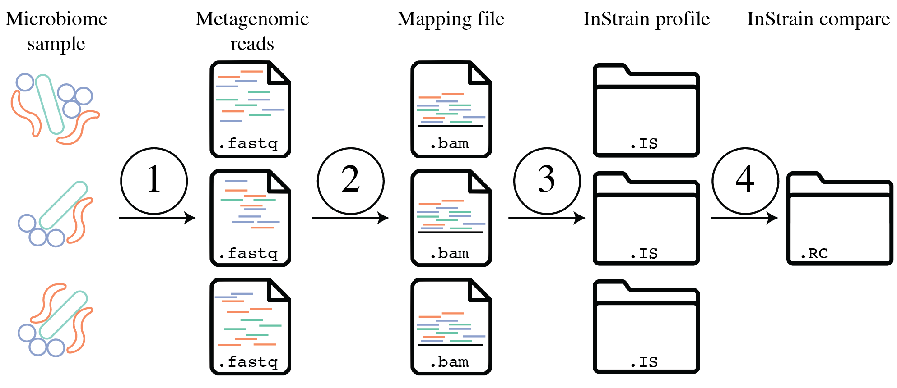
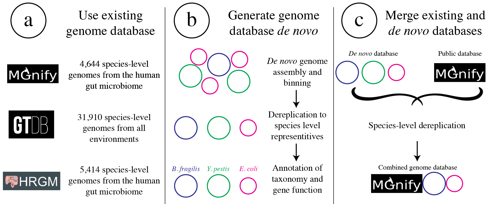

Tutorial
===================

The above figure provides a conceptual overview of the steps involved when running inStrain. Step 1 is generating sequencing reads, step 2 is mapping those sequencing reads to a :term:`Genome database`, step 3 is profiling the mapping with ``inStrain profile``, step 4 is comparing inStrian profiles using ``inStrain compare``.

Quick Start
-----------

The two main operations of inStrain are ``compare`` and ``profile``.

Profile
++++++++++

``InStrain profile`` takes as input a :term:`fasta file` and a :term:`bam file` and runs a series of steps to characterize the :term:`nucleotide diversity`, :term:`SNSs<SNS>` and :term:`SNVs<SNV>`, :term:`linkage`, etc.. If one provides a :term:`scaffold-to-bin file` it will calculate genome-level metrics, and if one provides a :term:`genes file` it will calculate gene level metrics.

The most basic ``inStrain profile`` command has this form::

 $ inStrain profile .bam_file .fasta_file -o IS_output_name

Compare
++++++++++

``InStrain compare`` takes as input multiple ``inStrain profile`` objects (generated using the command above) and performs strain-level comparisons. Each ``inStrain profile`` object used by ``InStrain compare`` must be made from reads mapped to the same :term:`fasta file`.

The most basic inStrain compare command looks like this::

 $ inStrain compare -i IS_output_1 IS_output_2 IS_output_3

Other
++++++++++

There are a number of other operations that inStrain can perform as well, although these generally perform more niche tasks. Check the program help (``inStrain -h``) to see a full list of the available operations ::

    $ inStrain -h

                    ...::: inStrain v1.4.0 :::...

      Matt Olm and Alex Crits-Christoph. MIT License. Banfield Lab, UC Berkeley. 2019

      Choose one of the operations below for more detailed help. See https://instrain.readthedocs.io for documentation.
      Example: inStrain profile -h

      Workflows:
        profile         -> Create an inStrain profile (microdiversity analysis) from a mapping.
        compare         -> Compare multiple inStrain profiles (popANI, coverage_overlap, etc.)

      Single operations:
        profile_genes   -> Calculate gene-level metrics on an inStrain profile [DEPRECATED; PROVIDE GENES TO profile]
        genome_wide     -> Calculate genome-level metrics on an inStrain profile [DEPRECATED; PROVIDE .stb FILES TO profile / compare]
        quick_profile   -> Quickly calculate coverage and breadth of a mapping using coverM
        filter_reads    -> Commands related to filtering reads from .bam files
        plot            -> Make figures from the results of "profile" or "compare"
        other           -> Other miscellaneous operations

.. seealso::
  :doc:`installation`
    To get started using the program
  :doc:`user_manual`
    For descriptions of what the modules can do and information on how to prepare data for inStrain
  :doc:`example_output`
    To view example output and how to interpret it

Example inStrain commands
----------------------------

Running inStrain profile on a single genome

 ::

  inStrain profile mappingfile.bam genomefile.fasta -o outputlocation.IS -p 6 -g genesfile.fasta

Running inStrain profile on a large set of genomes

 ::

  inStrain profile mappingfile.bam genomesfile.fasta -o outputlocation.IS -p 6 -g genesfile.fasta -s scaffoldtobin.stb --database_mode

Running inStrain compare on a large set of genomes

 ::

  inStrain compare -i genomefile-vs-sample1.IS/ genomefile-vs-sample2.IS/ -o genomefile.IS.COMPARE -p 6 -s scaffoldtobin.stb --database_mode

Tutorials
-----------

The following tutorials give step-by-step instructions on how to run inStrain a couple of different ways. The main difference between these tutorials is in how the :term:`Genome database` used for inStrain analysis is generated. The user to inStrain decides on their own what genomes should be used for analysis, and there are a couple of broad options as depicted in the figure below.

**Tutorial #1** uses test data that comes packaged with the inStrain source code to go through the basic steps of the program. It also describes how you can run using genomes that you have generated on your own.

**Tutorial #2** describes how to run inStrain using an existing, public genome database. This way of running inStrain avoids the need for metagenomic assembly and genome binning.

**Tutorial #3** describes how to combine custom genomes with an existing genome database. This allows users to include both sample-specific :term:`representative genomes<Representative genome>` and an existing genome database, and allows for comprehensive, accurate analysis.

Tutorial #1) Running inStrain on provided test data
-------------------------------------------------------

The following tutorial goes through an example run of inStrain. You can follow along with your own data, or use a small set of reads that are included in the inStrain source code for testing. They can be found in the folder ``test/test_data/`` of your install folder, or can be downloaded from the inStrain source code at `this link on GitHub
<https://github.com/MrOlm/inStrain/tree/master/test/test_data>`_. The files that we'll use for this tutorial are the forward and reverse metagenomic reads (``N5_271_010G1.R1.fastq.gz`` and ``N5_271_010G1.R2.fastq.gz``) and a .fasta file to map to (``N5_271_010G1_scaffold_min1000.fa``). In case you're curious, these metagenomic reads come from a `premature infant fecal sample <https://www.ncbi.nlm.nih.gov/biosample/?term=N5_271_010G1>`_.

Preparing input files
++++++++++++++++++++++++++++++++++

After downloading the genome file that you would like to profile (the :term:`fasta file`) and at least one set of paired reads, the first thing to do is to map the reads to the .fasta file in order to generate a :term:`bam file`.

When this mapping is performed it is important that you map to all genomes simultaneously (see :doc:`important_concepts` for why this is important). This involves combining all of the genomes that you'd like to map into a single .fasta file. In our case our .fasta file already has all of the genomes that we'd like to profile within it, but if you did want to profile a number of different genomes, you could combine them using a command like this ::

 $  cat raw_data/S2_002_005G1_phage_Clostridioides_difficile.fasta raw_data/S2_018_020G1_bacteria_Clostridioides_difficile.fasta > allGenomes_v1.fasta

When we do this we also need to generate a file to let inStrain know which scaffolds came from which genomes. We can do this by giving inStrain a list of the .fasta files that went into making the concatenated .fasta file, or we can make a :term:`scaffold-to-bin file` file, which lists the genome assignment of each scaffold in a tab-delimited file. This is how to do the later method using the `parse_stb.py script <https://github.com/MrOlm/drep/blob/master/helper_scripts/parse_stb.py>`_ that comes with the program ``dRep`` (Installed with the command ``pip install drep --upgrade``) ::

  $ parse_stb.py --reverse -f raw_data/S2_002_005G1_phage_Clostridioides_difficile.fasta  raw_data/S2_018_020G1_bacteria_Clostridioides_difficile.fasta  -o genomes.stb
Next we must map our reads to this :term:`fasta file` to create :term:`bam files<bam file>`. In this tutorial we will use the mapping program Bowtie 2 ::

 $ mkdir bt2

 $ bowtie2-build ~/Programs/inStrain/test/test_data/N5_271_010G1_scaffold_min1000.fa bt2/N5_271_010G1_scaffold_min1000.fa

 $ bowtie2 -p 6 -x bt2/N5_271_010G1_scaffold_min1000.fa -1 ~/Programs/inStrain/test/test_data/N5_271_010G1.R1.fastq.gz -2 ~/Programs/inStrain/test/test_data/N5_271_010G1.R2.fastq.gz > N5_271_010G1_scaffold_min1000.fa-vs-N5_271_010G1.sam

At this point we have generated a .sam file, the precursor to .bam files. Lets make sure it's there and not empty ::

 $ ls -lht

 total 34944
 -rw-r--r--  1 mattolm  staff    16M Jan 23 11:56 N5_271_010G1_scaffold_min1000.fa-vs-N5_271_010G1.sam
 drwxr-xr-x  8 mattolm  staff   256B Jan 23 11:54 bt2/

Perfect. At this point we could convert the .sam file to a sorted and indexed .bam file using `samtools <http://www.htslib.org/>`_, but since inStrain can do that for us automatically we won't bother.

If we want inStrain to do gene-level profiling we need to give it a list of genes to profile. **Note - this is an optional step that is not required for inStrain to work in general, but without this you will not get gene-level profiles**

We will profile our genes using the program prodigal, which can be run using the following example command ::

 $ prodigal -i ~/Programs/inStrain/test/test_data/N5_271_010G1_scaffold_min1000.fa -d N5_271_010G1_scaffold_min1000.fa.genes.fna

Running inStrain profile
++++++++++++++++++++++++++++++++++

Now that we've gotten everything set up it's time to run inStrain. To see all of the options, run ::

 $ inStrain profile -h

A long list of arguments and options will show up. For more details on what these do, see :doc:`user_manual`. The **only** arguments that are absolutely required, however, are a .sam or .bam mapping file, and the .fasta file that the mapping file is mapped to.

.. note::
  In this case we're going to have inStrain profile the mapping, call genes, make the results genome wide, and plot the results all in one command. This is the recommended way to do things for the most computational efficiency. The other, not recommended way would be to run these all as separate steps (using the subcommands ``inStrain profile``, ``inStrain profile_genes``, ``inStrain genome_wide``, and ``inStrain plot``). See :doc:`user_manual` for more information.

Using all of the files we generated above, here is going to be our inStrain command ::

 $ inStrain profile N5_271_010G1_scaffold_min1000.fa-vs-N5_271_010G1.sam ~/Programs/inStrain/test/test_data/N5_271_010G1_scaffold_min1000.fa -o N5_271_010G1_scaffold_min1000.fa-vs-N5_271_010G1.IS -p 6 -g N5_271_010G1_scaffold_min1000.fa.genes.fna -s ~/Programs/inStrain/test/test_data/N5_271_010G1.maxbin2.stb

You should see the following as inStrain runs (should only take a few minutes) ::

    You gave me a sam- I'm going to make it a .bam now
    Converting N5_271_010G1_scaffold_min1000.fa-vs-N5_271_010G1.sam to N5_271_010G1_scaffold_min1000.fa-vs-N5_271_010G1.ba
    m
    samtools view -S -b N5_271_010G1_scaffold_min1000.fa-vs-N5_271_010G1.sam > N5_271_010G1_scaffold_min1000.fa-vs-N5_271_
    010G1.bam
    sorting N5_271_010G1_scaffold_min1000.fa-vs-N5_271_010G1.bam
    samtools sort N5_271_010G1_scaffold_min1000.fa-vs-N5_271_010G1.bam -o N5_271_010G1_scaffold_min1000.fa-vs-N5_271_010G1
    .sorted.bam -@ 6
    [bam_sort_core] merging from 0 files and 6 in-memory blocks...
    Indexing N5_271_010G1_scaffold_min1000.fa-vs-N5_271_010G1.sorted.bam
    samtools index N5_271_010G1_scaffold_min1000.fa-vs-N5_271_010G1.sorted.bam N5_271_010G1_scaffold_min1000.fa-vs-N5_271_
    010G1.sorted.bam.bai -@ 6
    ***************************************************
        ..:: inStrain profile Step 1. Filter reads ::..
    ***************************************************

    Filtering reads: 100%|██████████████████████████████████████████████████████████████| 178/178 [00:02<00:00, 70.99it/s]
    37.3% of reads were removed during filtering
    1,727 read pairs remain (0.0004472 Gbp)
    ***************************************************
    .:: inStrain profile Step 2. Profile scaffolds ::..
    ***************************************************

    Profiling splits: 100%|█████████████████████████████████████████████████████████████████| 7/7 [00:05<00:00,  1.21it/s]
    Merging splits and profiling genes: 100%|███████████████████████████████████████████████| 7/7 [00:08<00:00,  1.18s/it]
    ***************************************************
    .:: inStrain profile Step 4. Make genome-wide ::..
    ***************************************************

    Scaffold to bin was made using .stb file
    85.66% of scaffolds have a genome
    93.82% of scaffolds have a genome
    99.30% of scaffolds have a genome
    ***************************************************
     .:: inStrain profile Step 5. Generate plots ::..
    ***************************************************
    making plots 1, 2, 3, 4, 5, 6, 7, 8, 9
    Plotting plot 1
    Plotting plot 2
    85.66% of scaffolds have a genome
    Plotting plot 3
    57.37% of scaffolds have a genome
    Plotting plot 4
    97.33% of scaffolds have a genome
    Plotting plot 5
    Plotting plot 6
    Plotting plot 7
    97.33% of scaffolds have a genome
    Plotting plot 8
    94.32% of scaffolds have a genome
    Plotting plot 9
    $$$$$$$$$$$$$$$$$$$$$$$$$$$$$$$$$$$$$$$$$$$$$$$$$$$$$$$$$$$$$$$$$$$$$$$$$$$$$$$$

    ..:: inStrain profile finished ::..

    Output tables........ N5_271_010G1_scaffold_min1000.fa-vs-N5_271_010G1.IS/output/
    Figures.............. N5_271_010G1_scaffold_min1000.fa-vs-N5_271_010G1.IS/figures/
    Logging.............. N5_271_010G1_scaffold_min1000.fa-vs-N5_271_010G1.IS/log/

    See documentation for output descriptions - https://instrain.readthedocs.io/en/latest/

    $$$$$$$$$$$$$$$$$$$$$$$$$$$$$$$$$$$$$$$$$$$$$$$$$$$$$$$$$$$$$$$$$$$$$$$$$$$$$$$$

The last but of the output shows you where the plots and figures have been made. Here's a list of the files that you should see ::

    $ ls -lht N5_271_010G1_scaffold_min1000.fa-vs-N5_271_010G1.IS/output/
    total 91K
    -rw-rw-r-- 1 mattolm infantgi  35K Jan 15 10:10 N5_271_010G1_scaffold_min1000.fa-vs-N5_271_010G1.IS_SNVs.tsv
    -rw-rw-r-- 1 mattolm infantgi 1.2K Jan 15 10:10 N5_271_010G1_scaffold_min1000.fa-vs-N5_271_010G1.IS_genome_info.tsv
    -rw-rw-r-- 1 mattolm infantgi  23K Jan 15 10:10 N5_271_010G1_scaffold_min1000.fa-vs-N5_271_010G1.IS_mapping_info.tsv
    -rw-rw-r-- 1 mattolm infantgi  92K Jan 15 10:10 N5_271_010G1_scaffold_min1000.fa-vs-N5_271_010G1.IS_gene_info.tsv
    -rw-rw-r-- 1 mattolm infantgi  15K Jan 15 10:10 N5_271_010G1_scaffold_min1000.fa-vs-N5_271_010G1.IS_linkage.tsv
    -rw-rw-r-- 1 mattolm infantgi  30K Jan 15 10:10 N5_271_010G1_scaffold_min1000.fa-vs-N5_271_010G1.IS_scaffold_info.tsv

    $ ls -lht N5_271_010G1_scaffold_min1000.fa-vs-N5_271_010G1.IS/figures/
    total 3.5M
    -rw-rw-r-- 1 mattolm infantgi 386K Jan 15 10:10 N5_271_010G1_scaffold_min1000.fa-vs-N5_271_010G1.IS_GeneHistogram_plot.pdf
    -rw-rw-r-- 1 mattolm infantgi 379K Jan 15 10:10 N5_271_010G1_scaffold_min1000.fa-vs-N5_271_010G1.IS_LinkageDecay_types_plot.pdf
    -rw-rw-r-- 1 mattolm infantgi 404K Jan 15 10:10 N5_271_010G1_scaffold_min1000.fa-vs-N5_271_010G1.IS_ScaffoldInspection_plot.pdf
    -rw-rw-r-- 1 mattolm infantgi 375K Jan 15 10:10 N5_271_010G1_scaffold_min1000.fa-vs-N5_271_010G1.IS_ReadFiltering_plot.pdf
    -rw-rw-r-- 1 mattolm infantgi 378K Jan 15 10:10 N5_271_010G1_scaffold_min1000.fa-vs-N5_271_010G1.IS_LinkageDecay_plot.pdf
    -rw-rw-r-- 1 mattolm infantgi 377K Jan 15 10:10 N5_271_010G1_scaffold_min1000.fa-vs-N5_271_010G1.IS_MajorAllele_frequency_plot.pdf
    -rw-rw-r-- 1 mattolm infantgi 375K Jan 15 10:10 N5_271_010G1_scaffold_min1000.fa-vs-N5_271_010G1.IS_readANI_distribution.pdf
    -rw-rw-r-- 1 mattolm infantgi 400K Jan 15 10:10 N5_271_010G1_scaffold_min1000.fa-vs-N5_271_010G1.IS_genomeWide_microdiveristy_metrics.pdf
    -rw-rw-r-- 1 mattolm infantgi 376K Jan 15 10:10 N5_271_010G1_scaffold_min1000.fa-vs-N5_271_010G1.IS_CoverageAndBreadth_vs_readMismatch.pdf

We have now successfully generated an inStrain profile! For help interpreting the output files, see :doc:`example_output`

Running inStrain compare
++++++++++++++++++++++++++++++++++

``InStrain compare`` compare genomes that have been profiled by multiple different metagenomic mappings. To compare genomes in the sample we just profiled above, we need to generate another :term:`bam file` of reads from another sample to the **same** .fasta file. Provided in the `inStrain test_data folder <https://github.com/MrOlm/inStrain/tree/master/test/test_data>`_ is exactly that- another different set of reads mapped to the same .fasta file (`N5_271_010G1_scaffold_min1000.fa-vs-N5_271_010G2.sorted.bam <https://github.com/MrOlm/inStrain/blob/master/test/test_data/N5_271_010G1_scaffold_min1000.fa-vs-N5_271_010G2.sorted.bam>`_). Let's run inStrain on this to make a new inStrain profile ::

  $ inStrain profile test_data/N5_271_010G1_scaffold_min1000.fa-vs-N5_271_010G2.sorted.bam N5_271_010G1_scaffold_min1000.fa -o N5_271_010G1_scaffold_min1000.fa-vs-N5_271_010G2.IS -p 6 -g N5_271_010G1_scaffold_min1000.fa.genes.fna -s N5_271_010G1.maxbin2.stb

To see the help section for ``inStrain compare`` run::

  $ inStrain compare -h

As above, this will print out a whole list of parameters that can be turned depending on your specific use-case. :doc:`important_concepts` and :doc:`user_manual` provide some insight into what these parameters do and how to tune them. For the purposes of this tutorial we're going to use mostly default parameters, giving us the following command ::

    $ inStrain compare -i N5_271_010G1_scaffold_min1000.fa-vs-N5_271_010G1.IS/ N5_271_010G1_scaffold_min1000.fa-vs-N5_271_010G2.IS/ -s .N5_271_010G1.maxbin2.stb -p 6 -o N5_271_010G1_scaffold_min1000.fa.IS.COMPARE

This command should produce the following output ::

    Scaffold to bin was made using .stb file
    ***************************************************
        ..:: inStrain compare Step 1. Load data ::..
    ***************************************************

    Loading Profiles into RAM: 100%|████████████████████████████████████████████████████████| 2/2 [00:00<00:00, 67.45it/s]
    158 of 167 scaffolds are in at least 2 samples
    ***************************************************
    ..:: inStrain compare Step 2. Run comparisons ::..
    ***************************************************

    Running group 1 of 1
    Comparing scaffolds: 100%|██████████████████████████████████████████████████████████| 158/158 [00:04<00:00, 36.12it/s]
    ***************************************************
    ..:: inStrain compare Step 3. Auxiliary processing ::..
    ***************************************************

    ***************************************************
    ..:: inStrain compare Step 4. Store results ::..
    ***************************************************

    making plots 10
    Plotting plot 10
    /home/mattolm/.pyenv/versions/3.6.10/lib/python3.6/site-packages/inStrain/plottingUtilities.py:963: UserWarning: FixedFormatter should only be used together with FixedLocator
      axes.set_xticklabels(labels)
    /home/mattolm/.pyenv/versions/3.6.10/lib/python3.6/site-packages/inStrain/plottingUtilities.py:963: UserWarning: FixedFormatter should only be used together with FixedLocator
      axes.set_xticklabels(labels)
    Done!
    $$$$$$$$$$$$$$$$$$$$$$$$$$$$$$$$$$$$$$$$$$$$$$$$$$$$$$$$$$$$$$$$$$$$$$$$$$$$$$$$

    ..:: inStrain compare finished ::..

    Output tables........ N5_271_010G1_scaffold_min1000.fa.IS.COMPARE/output/
    Figures.............. N5_271_010G1_scaffold_min1000.fa.IS.COMPARE/figures/
    Logging.............. N5_271_010G1_scaffold_min1000.fa.IS.COMPARE/log/

    See documentation for output descriptions - https://instrain.readthedocs.io/en/latest/

    $$$$$$$$$$$$$$$$$$$$$$$$$$$$$$$$$$$$$$$$$$$$$$$$$$$$$$$$$$$$$$$$$$$$$$$$$$$$$$$$

As before, the last part of the output shows you where the plots and figures have been made. Here's a list of the files that you should see ::

    $ ls -lht N5_271_010G1_scaffold_min1000.fa.IS.COMPARE/output/
    total 14K
    -rw-rw-r-- 1 mattolm infantgi 28K Jan 15 10:33 N5_271_010G1_scaffold_min1000.fa.IS.COMPARE_comparisonsTable.tsv
    -rw-rw-r-- 1 mattolm infantgi 352 Jan 15 10:33 N5_271_010G1_scaffold_min1000.fa.IS.COMPARE_strain_clusters.tsv
    -rw-rw-r-- 1 mattolm infantgi 554 Jan 15 10:33 N5_271_010G1_scaffold_min1000.fa.IS.COMPARE_genomeWide_compare.tsv

    $ ls  -lht N5_271_010G1_scaffold_min1000.fa.IS.COMPARE/figures/
    total 393K
    -rw-rw-r-- 1 mattolm infantgi 376K Jan 15 10:33 N5_271_010G1_scaffold_min1000.fa.IS.COMPARE_inStrainCompare_dendrograms.pdf

Success! As before, for help interpreting this output see :doc:`example_output` .

Tutorial #2) Running inStrain using a public genome database
---------------------------------------------------------------

If you don't want to assemble and bin your metagenomic samples it is also possible to run inStrain using publicly available reference genomes. Here we will go through a tutorial on how to do this with the `UHGG genome collection <https://www.nature.com/articles/s41587-020-0603-3>`_, a collection of all microbial species known to exist in the human gut. The steps in this tutorial could be repeated with any set of genomes though.

Preparing a genome database
++++++++++++++++++++++++++++

.. note::

  The genome database created in this section is available for direct download at the following link - https://doi.org/10.5281/zenodo.4441269 . You can download those files directly and skip this section if you would like. **This genome set is based on UHGG version 1 and was created on Jan 14, 2021**.

In order to create a genome database we need to download the genomes, create a :term:`scaffold-to-bin file`, create a :term:`genes file`, and merge all genomes into a single :term:`fasta file` that we can make a bowtie2 mapping index out of. All genomes in a genome need to database need to be distinct from one another, but not too distinct. See section "Establishing and evaluating genome databases" in :doc:`important_concepts` for more info.

First we must download the UHGG genomes themselves. The FTP site is `here <http://ftp.ebi.ac.uk/pub/databases/metagenomics/mgnify_genomes/human-gut/v1.0/>`_, and metadata on genomes is `genomes-all_metadata.tsv <http://ftp.ebi.ac.uk/pub/databases/metagenomics/mgnify_genomes/human-gut/v1.0/genomes-all_metadata.tsv>`_. Let's download this metadata file using curl::

  $ curl http://ftp.ebi.ac.uk/pub/databases/metagenomics/mgnify_genomes/human-gut/v1.0/genomes-all_metadata.tsv -o genomes-all_metadata.tsv

Now that we have this metadata file we need to download all species representative genomes. There are a number of ways to do this, but we're going to do it by parsing the metadata table in unix. Running the following command will 1) identify columns of species representatives, 2) parse the row to determine their FTP location, 3) create and run a ``curl`` command to download the genome::

  $ cat genomes-all_metadata.tsv | awk -F "\t" '{if ($17 == $1) print "curl ftp://ftp.ebi.ac.uk/pub/databases/metagenomics/mgnify_genomes/human-gut/v1.0/uhgg_catalogue/" substr($18,0,13) "/" $18 "/genome/" $18 ".fna -o UHGG_reps/" $1 ".fna"}' | bash

The following command will let us check and make sure that we downloaded all 4644 genomes::

  $ ls UHGG_reps/ | wc -l
    4644

Next we need to create a :term:`scaffold-to-bin file`. This can easily be done using the script `parse_stb.py <https://github.com/MrOlm/drep/blob/master/helper_scripts/parse_stb.py>`_ that comes with the program ``dRep``::

  $ parse_stb.py --reverse -f UHGG_reps/* -o UHGG.stb

Next we'll profile the genes for each genome using Prodigal to create a :term:`genes file`. This can be done on the concatenated genome file (created below) or on the individual genomes (as shown in this code chunk). The benefit of the later is that it allows Prodigal to be run in single genome mode, as opposed to metagenome mode, which can be more accurate::

  $ mkdir UHGG_genes

  $ cd UHGG_reps/

  $ for genome in $(ls *.fna); do echo prodigal -i $genome -o ../UHGG_genes/$genome.genes -a ../UHGG_genes/$genome.gene.faa -d ../UHGG_genes/$genome.gene.fna -m -p single; done | parallel -j 6

  $ cat UHGG_genes/*.gene.fna > UHGG_reps.genes.fna

  $ cat UHGG_genes/*.gene.faa > UHGG_reps.genes.faa

Finally we need to concatenate all genomes together into a single :term:`fasta file` and create a bowtie2 mapping index from it::

  $ cat UHGG_reps/* > UHGG_reps.fasta

  $ bowtie2-build UHGG_reps.fasta UHGG_reps.fasta.bt2 --large-index --threads 20

Mapping to the Genome Database
+++++++++++++++++++++++++++++++

Here we will use the program Bowtie2 to align our reads to the reference database. If you downloaded the pre-made version of bowtie2 index, you'll need to extract it using the following command ::

  $ tar -zxvf UHGG_reps_v1.bt2.tgz

This should yield a set of 5 files that end in ``.bt2l``

Next we need to map our metagenomic reads to the database. For the purposes of this tutorial we'll use metagenomic reads that came from a `premature infant fecal sample <https://www.ncbi.nlm.nih.gov/biosample/?term=N5_216_039G1>`_. The bowtie2 command to map these reads is ::

  $ bowtie2 -p 10 -x /groups/banfield/projects/human/data8/ExternalData/UHGG/UHGG_reps.fasta.bt2 -1 /groups/banfield/projects/human/data8/raw.d/NIH5/reads/HR/N5_216_039G1_T0140F_S50_L002.HR.R1.fastq.gz -2 /groups/banfield/projects/human/data8/raw.d/NIH5/reads/HR/N5_216_039G1_T0140F_S50_L002.HR.R2.fastq.gz > UHGG_reps.fasta-vs-N5_216_039G1.sam

    7032881 reads; of these:
      7032881 (100.00%) were paired; of these:
        1690938 (24.04%) aligned concordantly 0 times
        1905098 (27.09%) aligned concordantly exactly 1 time
        3436845 (48.87%) aligned concordantly >1 times
        ----
        1690938 pairs aligned concordantly 0 times; of these:
          139804 (8.27%) aligned discordantly 1 time
        ----
        1551134 pairs aligned 0 times concordantly or discordantly; of these:
          3102268 mates make up the pairs; of these:
            1851642 (59.69%) aligned 0 times
            279669 (9.01%) aligned exactly 1 time
            970957 (31.30%) aligned >1 times
    86.84% overall alignment rate

This mapping took just over 10 minutes on my computer. Notice how the bowtie2 states that over 85% of reads align to the database- this is an important number to consider, as all reads that do not align to the database will be invisible to inStrain. For human microbiome samples 85% is pretty good, but performing de novo genome assembly and including sample-specific genomes would undoubtedly raise this number.

Running inStrain profile
+++++++++++++++++++++++++

Next we'll profile the .sam file created above with inStrain. To do this we'll need the :term:`scaffold-to-bin file`, :term:`genes file`, and :term:`fasta file` for the database that we created in the first step. If you downloaded them you can decompress them with the commands ::

  $ gzip -d UHGG_reps.fasta.gz

  $ gzip -d UHGG_reps.genes.fna.gz

**When running inStrain on a big database like we have here it's critical to add the flag ``--database mode``. This flag does some quick calculations to figure out which genomes are probably not present, and stops working on them right away. This leads to dramatic reductions in RAM usage and computational time.

The inStrain profile command we'll use now is ::

  $ inStrain profile UHGG_reps.fasta-vs-N5_216_039G1.sam /groups/banfield/projects/human/data8/ExternalData/UHGG/UHGG_reps.fasta -o UHGG_reps.fasta-vs-N5_216_039G1.IS -p 10 -g /groups/banfield/projects/human/data8/ExternalData/UHGG/UHGG_reps.genes.fna -s /groups/banfield/projects/human/data8/ExternalData/UHGG/UHGG_reps.stb --database_mode

This took just over an hour to run on my computer. We have now successfully generated an inStrain profile! For help interpreting the output files, see :doc:`example_output`. To link the genomes in the UHGG database with their taxonomy, use the file ``genomes-nr_metadata.tsv`` which we downloaded above and is part of the overall download as well. To subset to just the :term:`species representative genomes<Species representative genome>` (SRGs) that make up this database, subset this table to only include rows where the column "Genome" is equal to the column "Species_rep".

Running inStrain compare
+++++++++++++++++++++++++

``InStrain compare`` compare genomes that have been profiled by multiple different metagenomic mappings. To compare genomes in the sample we just profiled above, we need to generate another :term:`bam file` of reads from another sample to the **same** .fasta file. For example, something like the command (based on reads from `this fecal sample from the same premature infant <https://www.ncbi.nlm.nih.gov/biosample/?term=N5_216_046G1>`_)::

  bowtie2 -p 10 -x /groups/banfield/projects/human/data8/ExternalData/UHGG/UHGG_reps.fasta.bt2 -1 /groups/banfield/projects/human/data8/raw.d/NIH5/reads/HR/N5_216_046G1_T0140F_S50_L002.HR.R1.fastq.gz -2 /groups/banfield/projects/human/data8/raw.d/NIH5/reads/HR/N5_216_046G1_T0140F_S50_L002.HR.R2.fastq.gz > UHGG_reps.fasta-vs-N5_216_046G1.sam

  $ inStrain profile UHGG_reps.fasta-vs-N5_216_046G1.sam /groups/banfield/projects/human/data8/ExternalData/UHGG/UHGG_reps.fasta -o UHGG_reps.fasta-vs-N5_216_046G1.IS -p 10 -g /groups/banfield/projects/human/data8/ExternalData/UHGG/UHGG_reps.genes.fna -s /groups/banfield/projects/human/data8/ExternalData/UHGG/UHGG_reps.stb --database_mode

Now that we have two inStrain profile objects based on reads mapped to the same .fasta file, we can compare all detected genomes using the following command::

  inStrain compare -i UHGG_reps.fasta-vs-N5_216_039G1.IS/ UHGG_reps.fasta-vs-N5_216_046G1.IS/ -s /groups/banfield/projects/human/data8/ExternalData/UHGG/UHGG_reps.stb -p 6 -o UHGG_reps.fasta.IS.COMPARE --database_mode

Success! As before, for help interpreting this output see :doc:`example_output`.

Tutorial #3) Merging custom genomes with an existing genome database.
-----------------------------------------------------------------------

Using a combination of sample-specific genomes for accuracy and public genome databases for comprehensiveness can provide the best of both worlds. The steps are as follows:

1) Establish a set of data-set specific genomes through de novo genome assembly and binning. This could be done using a tool such as `anvi’o <http://merenlab.org/software/anvio/>`_, for example.

2) Download an entire database of individual genomes. See the top of Tutorial #2 for instructions on downloading UHGG.

3) Dereplicate both sets of genomes. The specific threshold you use for dereplication is important and some thoughts about choosing thresholds is available at :doc:`important_concepts`. A program that can be used for this purpose is `dRep <https://drep.readthedocs.io/en/latest/>`_; just make sure you have dRep version 3 which is able to handle much larger genome sets than previous versions. An example command that could be used for this step is ::

  dRep dereplicate MergedGenomeSet -g FullListOfGenomes.txt --S_algorithm fastANI --multiround_primary_clustering --clusterAlg greedy -ms 10000 -pa 0.9 -sa 0.95 -nc 0.30 -cm larger -p 16

This command will result in a species-level dereplicated set of genomes that include both your custom genomes and the database genomes. More details on genome dereplication can be found `here <https://drep.readthedocs.io/en/latest/choosing_parameters.html#>`_. To prioritize your custom genomes over the database genomes, use the flag `extra_weight_table` within dRep.

4) Create a genome database out of the genomes in the `dereplicated_genomes` folder produced in the step above. This can be done following the instructions at the top of Tutorial #2.
